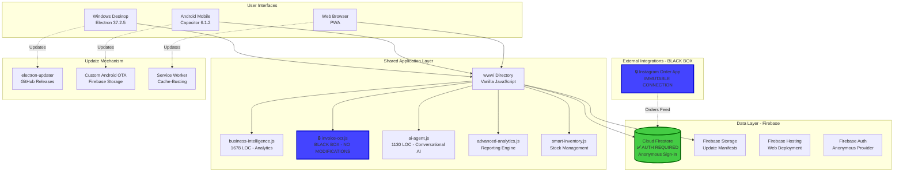

# 🏆 GOLDEN MANIFEST (REVISED)
## The Ultimate Source of Truth for Danfosal App

**Audit Date:** February 9, 2026  
**Auditor:** Senior Principal Software Architect & Lead Security Auditor  
**Application Version:** 1.4.1  
**Danfos Garanci Version:** 1.1.0 (separate Windows app; installed September 13, 2026)  
**Verdict:** ✅ **PRODUCTION-READY & SECURED**  
**Last Updated:** September 21, 2026 (Albanian invoice scanner now reads the PDF text layer instead of OCR-ing a picture of it, and no longer matches the wrong product; see Finding #23)  
**Overall Grade:** A- (Security: A- | Performance: A | Organization: A | Documentation: A+ | held back from A by Finding #4 — backups not actually scheduled)

> **Confirmed scope (Aug 24, 2026):** This app is used only by the owner (Kushtrim), on his own PC and his own phone (sideloaded APK) — it is **not distributed** to staff, customers, or the public, and it is **not connected to Albania's e-Fiscalization/tax system**. A separate app (linked to EasyPOS) is the official system of record for taxes. This app exists purely to track sales/data for the owner's own business decisions, because it's more data-rich than the official fiscal app. This supersedes the fiscal-compliance framing in `docs/archive/GOLDEN_MANIFEST_v1.md` — float-money precision, NIPT/IIC OCR validation, and confidence-gating are **not** legal-risk items for this app and should not be re-flagged as such.

---

## 📋 EXECUTIVE SUMMARY

### What This Application Does
Danfosal App is an **internal business intelligence and operations dashboard** for Danfos Sh.P.K., an Albanian retail/wholesale business. This is a **private workflow automation tool** - NOT a fiscal device, NOT connected to tax authorities, and NOT used for official tax filings.

**Core Functions:**
- **Internal Order Management:** Track online orders (Instagram/WhatsApp), in-store sales, supplier invoices
- **Inventory Tracking:** Real-time stock monitoring with reorder alerts
- **Business Intelligence:** AI-powered demand forecasting, sales analytics, anomaly detection
- **OCR Automation:** Quick data entry via invoice scanning (estimation/speed tool)
- **Multi-Platform Access:** Windows Desktop (Electron), Android mobile (Capacitor), Web PWA
- **Warranty & Service Workspace:** Separate Danfos Garanci Windows app for certificates, claims, machine histories, scheduling, parts, intake photos and repair costs; uses the same Firebase records (Finding #19).

### The Problem It Solves
Small retail operations struggle with:
1. **Manual data entry** - Hours spent typing product/invoice information
2. **Scattered information** - WhatsApp messages, paper notes, spreadsheets in different places
3. **No visibility** - Can't quickly see inventory levels or sales trends
4. **Instagram order chaos** - External Instagram ordering app needs to sync with internal systems

**Target Users:** Danfos Sh.P.K. staff (warehouse workers, sales team, management) - **internal use only**.

**Legal Context:** This app does NOT interface with Albania's e-Fiscalization system. All fiscal compliance happens through separate, government-approved devices/software. This is purely for internal estimation and workflow optimization.

### Critical Assessment
**Architectural Achievement:** Successfully maintains a unified codebase (`www/`) across three platforms with working OCR integration and Instagram sync.

**Security Posture:** ✅ **SECURED** (January 8, 2026) - Firebase Firestore now requires authentication (`if request.auth != null`). Anonymous auth implemented across all 26 files. External access blocked while maintaining full internal functionality.

**Precision Philosophy:** Mathematical precision is **acceptable at "good enough" levels**. Small rounding errors (€0.01 discrepancies) are tolerable since this is for internal estimates, not official accounting.

**Workflow Priority:** Speed > Precision. OCR/AI auto-save features are intentional - manual review would slow down operations.

**Code Quality:** Functional monolithic architecture. Works reliably for single-organization use. Recent optimizations eliminated 300+ redundant Firestore queries.

**Recent Fixes:**
- **Jan 8, 2026:** Authentication race conditions resolved, invalid date handling fixed, Smart Dashboard performance optimized, API key discrepancies corrected across 10+ files.
- **Feb 8, 2026:** Customer Loyalty Dashboard field name fix (customerName → clientName), EasyPOS OCR Bridge system fully documented, complete build processes documented, startup automation configured.
- **Feb 9, 2026:** 
  - **Morning:** Online order matching bug fixed in easypos-ocr-bridge.js (line 768: customerName → clientName), added 'Ordered' status to matching criteria, prevents duplicate walk-in sales for online orders. See: ONLINE_ORDER_MATCHING_FIX.md
  - **Afternoon:** Complete return/cancellation detection system implemented:
- **Apr 16, 2026:**
  - **receipt-listener.js created:** Missing IPC listener file was referenced in index.html but never existed, causing `ERR_FILE_NOT_FOUND` on every launch. Created with listeners for all preload bridge events (new-sale, new-sale-offline, order-fulfilled, sync-completed, parse-failed, sale-detected-graphics), re-dispatched as DOM CustomEvents.
  - **PDF.js added to index.html:** AI Chatbot PDF processing failed with "PDF library not loaded" because pdf.js (3.11.174) was never loaded in index.html. Added script tag + worker config matching other pages (store-sales.html, albanian-invoice-scanner.html).
  - **DevTools auto-open removed from main.js:** `mainWindow.webContents.openDevTools()` was left in production code, causing DevTools to open on every app launch. Removed.
    - Albanian credit note detection (NOTE KREDITI, KORRIGJUESE keywords)
    - Negative value extraction (-€99, -1 cope) with regex fixes
    - 3-strategy transaction matching (invoice → direct → customer+amount fallback)
    - Online order AND in-store sale return handling
    - Automatic stock return with Math.abs() conversion
    - "Veprim Arke" daily start marker filtering
    - Test case: Lindita Kollcinaku credit note (€99 return) successfully processed

**New in v3.0 (Feb 8-9, 2026):** 
- Complete EasyPOS OCR Bridge integration system documented including Windows Service print capture, Node.js OCR processing, Firebase data storage, startup automation, and build processes for both Android APK and Windows installer.
- Advanced return/cancellation detection system with Albanian credit note support, negative value extraction, multi-strategy transaction matching, automatic stock returns, and both online order + in-store sale handling.

---

## 🏗️ ARCHITECTURAL BLUEPRINT


```mermaid
graph TB
    subgraph "User Interfaces"
        A1[Windows Desktop<br/>Electron 37.2.5]
        A2[Android Mobile<br/>Capacitor 6.1.2]
        A3[Web Browser<br/>PWA]
    end

    subgraph "Shared Application Layer"
        B[www/ Directory<br/>Vanilla JavaScript]
        B --> B1[business-intelligence.js<br/>1678 LOC - Analytics]
        B --> B2[🔒 invoice-ocr.js<br/>BLACK BOX - NO MODIFICATIONS]
        B --> B3[ai-agent.js<br/>1130 LOC - Conversational AI]
        B --> B4[advanced-analytics.js<br/>Reporting Engine]
        B --> B5[smart-inventory.js<br/>Stock Management]
    end

    subgraph "External Integrations - BLACK BOX"
        F[🔒 Instagram Order App<br/>IMMUTABLE CONNECTION]
    end

    subgraph "Data Layer - Firebase"
        C1[(Cloud Firestore<br/>✅ AUTH REQUIRED<br/>Anonymous Sign-In)]
        C2[Firebase Storage<br/>Update Manifests]
        C3[Firebase Hosting<br/>Web Deployment]
        C4[Firebase Auth<br/>Anonymous Provider]
    end

    subgraph "Update Mechanism"
        D1[electron-updater<br/>GitHub Releases]
        D2[Custom Android OTA<br/>Firebase Storage]
        D3[Service Worker<br/>Cache-Busting]
    end

    A1 --> B
    A2 --> B
    A3 --> B
    
    F -.Orders Feed.-> C1
    
    B --> C1
    B --> C2
    
    A1 -.Updates.-> D1
    A2 -.Updates.-> D2
    A3 -.Updates.-> D3
    
    style C1 fill:#44cc44,stroke:#006600,stroke-width:3px
    style B2 fill:#4444ff,stroke:#0000cc,stroke-width:3px
    style F fill:#4444ff,stroke:#0000cc,stroke-width:3px
```

### Architecture Constraints

#### **🔒 BLACK BOX COMPONENTS (IMMUTABLE ZONES)**

These components are **off-limits for analysis, refactoring, or modification**:

1. **OCR Scanning System**
   - **Files:** `invoice-ocr.js`, `fiscal-invoice-scanner.js`, `store-invoice-scanner.js`
   - **Status:** Working as designed
   - **Rationale:** Speed-optimized workflow tool. Auto-save behavior is intentional.
   - **Rule:** Do NOT add validation layers, confidence thresholds, or review UIs.

2. **Instagram Integration**
   - **External System:** Instagram Order App (separate codebase)
   - **Connection Point:** Unknown (proprietary integration)
   - **Status:** Functional data feed
   - **Rule:** Do NOT analyze, modify, or "improve" this integration.

**Why These Are Immutable:**
- They work reliably in production
- Changing them would disrupt established workflows
- Staff are trained on current behavior
- Speed is more valuable than theoretical "correctness"

---

## 🔧 THE TECH STACK

### Frontend Layer
| Technology | Version | Usage | Notes |
|------------|---------|-------|-------|
| **Vanilla JavaScript** | ES6+ | Core application logic | No framework dependency |
| **Tailwind CSS** | 3.4.19, compiled locally | UI styling | ✅ Compiled build (Aug 24, 2026) — no longer the CDN. 7 separate builds in `www/css/tailwind-*.css`, one per distinct page config (6 pages have their own custom color/font theme; 22 plain pages share `tailwind-default.css`). Run `npm run build:css` after adding new Tailwind classes anywhere — the compiled CSS only contains classes that existed at build time, unlike the old CDN's live JIT. See Finding #10. |
| **Firebase SDK** | 11.6.1 (CDN) | Backend services | Mixed versions (10.7.1 - 11.6.1) — still true, not addressed |
| **Tesseract.js** | Latest | OCR (Black Box) | ⚠️ No modifications permitted |
| **SortableJS** | Latest | Drag-and-drop UI | Loaded via CDN |
| **Material Symbols Outlined** | Variable font (CDN) | Icons | Standardized as of Aug 24, 2026 across pages that previously mixed 3 different Material icon font families. Font `<link>` added to 17 pages that had icon spans but no icon font loaded at all — see Finding #10. |
| **FontAwesome** | 6.x | Icons | Loaded via CDN — used specifically by the AI Chatbot widget (`ai-chatbot.js`) for its robot/close/send icons. Do not remove without checking chatbot usage first. |

### Desktop Platform (Windows)
| Technology | Version | Purpose |
|------------|---------|---------|
| **Electron** | 37.2.5 | Native Windows wrapper |
| **electron-updater** | 6.6.2 | Auto-update via GitHub Releases |
| **electron-builder** | 24.13.3 | NSIS installer creation |

### Mobile Platform (Android)
| Technology | Version | Purpose |
|------------|---------|---------|
| **Capacitor** | 6.1.2 | Native Android bridge |
| **Gradle** | 8.x | Build system |
| **Minimum SDK** | 22 (Android 5.1) | Minimum version |
| **Target SDK** | 34 (Android 14) | Target version |

### Backend Services
| Service | Usage | Security Status |
|---------|-------|-----------------|
| **Cloud Firestore** | Primary database | ✅ Auth required (`request.auth != null`); anonymous sign-in only, no App Check yet |
| **Firebase Storage** | Update manifests | Public bucket |
| **Firebase Hosting** | Web hosting | `danfosal-app.web.app` |
| **Firebase Auth** | Anonymous auth | No user accounts |

---

## 📊 DATA DICTIONARY

### Primary Collections (Cloud Firestore)

#### `products`
**Purpose:** Inventory catalog  
```typescript
{
  id: string,
  name: string,
  barcode?: string,
  category?: string,
  stock: number,              // Approximate count
  minStock: number,           // Reorder threshold
  costPrice: number,          // Estimated cost
  salePrice: number,          // Selling price
  supplier?: string,
  lastUpdated: Timestamp
}
```
**Note:** Stock numbers are estimates. Small discrepancies expected.

#### `onlineOrders`
**Purpose:** Customer orders from Instagram/WhatsApp  
```typescript
{
  id: string,
  orderNumber: string,
  clientName: string,
  clientPhone?: string,
  items: Array<{
    product: string,          // Denormalized name (intentional)
    quantity: number,
    price: number,
    total: number
  }>,
  total: number,
  status: string,
  timestamp: Timestamp,
  source?: "Instagram" | "WhatsApp" | "Manual"
}
```

#### `storeSales`
**Purpose:** In-store POS transactions  
```typescript
{
  id: string,
  receiptNumber: string,
  items: Array<{
    product: string,
    quantity: number,
    price: number,
    total: number
  }>,
  total: number,
  timestamp: Timestamp,
  paymentMethod: string
}
```

#### `creditors` (Supplier Invoices)
**Purpose:** Purchase orders tracked via OCR  
```typescript
{
  id: string,
  invoiceNumber: string,
  supplierName: string,
  items: Array<{
    product: string,
    quantity: number,
    unitPrice: number,
    total: number
  }>,
  total: number,
  amountPaid: number,
  amountDue: number,
  dueDate: Timestamp,
  ocrScanned?: boolean       // Auto-registered via OCR
}
```

**Data Philosophy:**
- **Denormalization is intentional** - Faster queries, simpler code
- **No foreign key constraints** - Speed > referential integrity
- **Approximate totals acceptable** - This is not accounting software

---

## 🚨 CRITICAL FINDINGS REPORT

### 🔴 **CRITICAL SEVERITY**

#### **1. SECURITY VULNERABILITY: PUBLIC DATABASE ACCESS** — ✅ **RESOLVED (Jan 8, 2026)**
**File:** `firestore.rules` (Line 6) — historical finding, kept for audit trail. Current rule is `allow read, write: if request.auth != null;`, confirmed still in place as of Aug 24, 2026.  
**Issue:**
```javascript
allow read, write: if true;  // Anyone can read/write EVERYTHING
```

**Impact:**
While this is internal business data (not customer PII or financial secrets), the database is vulnerable to:
- **Malicious deletion** - Any internet user can wipe the entire database
- **Data corruption** - Competitors could insert fake orders/inventory data
- **Service disruption** - Quota exhaustion attacks

**Why This Matters:**
Even though this is "just internal data," losing months of order history, inventory tracking, and supplier invoices would cripple operations. Recovery from backups (if they exist) takes hours/days.

**Remediation:**
```javascript
// firestore.rules - MINIMUM FIX
rules_version = '2';
service cloud.firestore {
  match /databases/{database}/documents {
    // Require ANY authentication (even anonymous)
    match /{document=**} {
      allow read, write: if request.auth != null;
    }
  }
}
```

**Why This Works for Internal Use:**
- App already uses `signInAnonymously()` (Line 1039 in index.html)
- Only authenticated app instances can access data
- External attackers blocked (they don't have auth tokens)
- No impact on workflow speed or user experience

**Estimated Fix Time:** 5 minutes  
**Business Risk:** Total data loss, operational shutdown

---

### 🟠 **HIGH SEVERITY**

#### **2. REPOSITORY BLOAT: 2GB+ OF UNUSED BUILD ARTIFACTS** — ✅ **RESOLVED** (confirmed `resources/app/java/` no longer exists, Aug 24, 2026)
**Files:**
- `java/jdk-11.0.2/` (~800MB)
- `java/jdk-17/` (~800MB)
- `java/jdk-17.0.8+7/` (~800MB)
- `*.zip` files (openjdk, android-sdk)

**Analysis:**
These are **accidental commits** from Android development. Capacitor/Gradle use the system's JDK, not these embedded files.

**Impact:**
- **Installer bloat:** Windows .exe is 2GB+ larger than necessary
- **Update bandwidth:** Users download unnecessary files
- **Git clone time:** New developers wait 10+ minutes
- **Storage costs:** GitHub LFS or repository size limits

**Remediation:**
See "Maintenance Commands" section below.

**Estimated Fix Time:** 10 minutes  
**Business Impact:** Faster updates, reduced hosting costs

---

### 🟡 **MEDIUM SEVERITY**

#### **3. MIXED FIREBASE SDK VERSIONS**
**Issue:** Different HTML files load different Firebase versions (10.7.1, 10.8.0, 11.6.1).

**Impact:**
- Potential API incompatibilities
- Larger cache footprint
- Harder debugging

**Recommendation:**
Standardize on version 11.6.1 across all files. Not urgent since everything works, but good housekeeping.

**Estimated Fix Time:** 1 hour  

---

#### **4. NO AUTOMATED BACKUPS** — ⚠️ **STILL OPEN** (corrected Aug 24, 2026 — do not trust the "COMPLETED" status claimed elsewhere in earlier revisions of this doc)
**Issue:** `resources/app/backup-firestore.ps1` exists on disk, but checking Windows Task Scheduler on Aug 24, 2026 (`schtasks /query`) found **no scheduled task registered for it or anything backup-related**. The script is not actually running automatically. This was previously marked "✅ COMPLETED" in this manifest based on the script existing, not on verifying it runs — that was wrong.

**Impact:**
If Finding #1's protection is ever bypassed (or you simply want history if you fat-finger a delete), there is currently no automated recovery path — only whatever you'd export manually.

**Recommendation:**
Actually register the scheduled task, e.g.:
```powershell
$action = New-ScheduledTaskAction -Execute "powershell.exe" -Argument "-File `"E:\DanfosalApp\resources\app\backup-firestore.ps1`""
$trigger = New-ScheduledTaskTrigger -Daily -At 2am
Register-ScheduledTask -TaskName "DanfosalFirestoreBackup" -Action $action -Trigger $trigger
```
Then re-verify with `schtasks /query` that it shows up before trusting this finding as resolved again.

**Estimated Fix Time:** 10 minutes  
**Business Risk:** Losing sales/customer history you rely on for business decisions, with no way to recover it

---

#### **5. FIREBASE ADMIN KEY BUNDLED INTO WINDOWS INSTALLER** — ✅ **RESOLVED (Aug 24, 2026)**
**File:** `resources/app/package.json` → `build.extraResources`

**Issue:** The electron-builder config copied the real `serviceAccountKey.json` (Firebase Admin credential — bypasses all Firestore rules) into every packaged `.exe`. Verified that neither `main.js` nor `export-pdf.js` (the only files that run inside the packaged app) ever read this file — only the standalone `easypos-ocr-bridge.js` process and the one-off maintenance scripts need it, and they read it directly from the source folder.

**Fix:** Removed the `extraResources` block. The key itself was not deleted or rotated (not needed for this internal single-user app), but it no longer ships inside build artifacts going forward. Note: any installer built *before* Aug 24, 2026 still has the old key baked in.

---

#### **6. VERSION NUMBER DRIFT ACROSS BUILD FILES** — ✅ **RESOLVED (Aug 24, 2026)**
**Files:** `package.json` (was 1.4.1), `android/app/build.gradle` versionName (was 1.4.0), `desktop-package.json` (was 1.3.1, unused/dead file, not referenced by any build config)

**Fix:** All three now read `1.4.1`. `android/app/build.gradle`'s `versionCode` (14) was intentionally left untouched — it's Android's monotonic install-ordering counter and only needs to increase on the next real Android build, not as part of a metadata cleanup.

---

### 🟢 **LOW SEVERITY** (Code Quality Issues)

#### **7. MONOLITHIC HTML FILES**
**Example:** `index.html` (1617 lines)

**Assessment:** This is fine for internal tools. Refactoring to a framework (React/Vue) would add complexity without significant benefit for a single-organization app.

**Recommendation:** Leave as-is unless team grows significantly.

---

#### **8. NO AUTOMATED TESTS**
**Issue:** No test suite found.

**Assessment:** For internal tools with known workflows, manual testing is often sufficient. The cost of writing tests may exceed the benefit.

**Recommendation:** Add tests only if bugs become frequent.

---

#### **9. REPO CLUTTER: ONE-OFF SCRIPTS, STRAY APK, HARDCODED KEYSTORE PASSWORD** — 🟢 **OPEN, not fixed (low priority)**
**Found Aug 24, 2026:**
- ~27 customer-named one-off maintenance scripts live permanently in `resources/app/` root (`fix-romina-order.js`, `cleanup-lindita.js`, `check-return-details.js`, etc.) — not shipped in builds, but clutter the working tree.
- A stray duplicate APK sits in the repo root (`Danfosal-App-v1.4.0-DATA-FIXED-2026-02-08_1921 - Copy.apk`, ~3.5MB, untracked).
- `sign-android-app.ps1` hardcodes the Android release keystore password as `"123456"`.

**Assessment:** None of this is dangerous for a single-user internal app, but it's worth a cleanup pass eventually — mainly so future AI-agent sessions working in this repo don't get confused by dead scripts or accidentally touch the wrong file.

**Recommendation:** Move one-off scripts to a `scripts/adhoc/` subfolder or delete once done; remove the stray APK; leave the keystore password alone unless re-generating the keystore (changing it now would just mean remembering a new password for no real security gain on a personal device).

---

#### **10. UI/UX AUDIT: TAILWIND CDN + FRAGMENTED ICON SYSTEM** — ✅ **RESOLVED (Aug 24, 2026)**
**Issue:** Full UI/UX audit found: (a) every page loaded Tailwind live from `cdn.tailwindcss.com`, recompiling in-browser on every page load with no offline fallback — confirmed via console warning "should not be used in production"; (b) icons were split across 4 unrelated systems — raw emoji, "Material Symbols Outlined", "Material Icons Round", and "Material Icons Outlined" — with 17 pages that used Material icon spans but had **no icon font loaded at all** (would have rendered as broken plain text, e.g. `inventory_2`, if the CDN version's icons were ever tested standalone); (c) the Products page back button was hardcoded to `store-sales.html` regardless of origin; (d) the low-stock badge threshold ignored each product's own `minStock` field.

**Fix:**
- Compiled Tailwind locally across all 28 pages that used it — see Tech Stack table above. **Critical constraint respected:** 6 pages turned out to have completely different, conflicting color palettes under the same class names (e.g. `primary` is indigo on Products, violet on Online Orders, bright green `#2bee79` on the POS screen) — each got its own dedicated compiled build using its *own* original config, rather than one merged config that would have silently repainted most pages the wrong color.
- Added the missing Material Symbols font `<link>` to 17 pages, then converted ~150 emoji instances to Material Symbols icons — but **only** where the emoji sat in true static HTML markup. Left untouched: anything inside `alert()`, `.textContent`, `<option>` labels, `<title>` tags, or placeholder attributes, since those render as plain text — an icon `<span>` there would show literal tag text to the user instead of an icon.
- **Explicitly not touched, per direct instruction:** `invoice-ocr.js`, `fiscal-invoice-scanner.js`, `store-invoice-scanner.js`, the four scanner-flavored pages (`albanian-invoice-scanner.html`, `invoice-scanner.html`, `smart-inventory-scanner.html`, `debug-ocr-extraction.html`), the barcode-scan section inside `notes.html`, and the AI chatbot (`ai-chatbot.js`/`ai-agent.js`) including its FontAwesome dependency — confirmed still in active use, not dead code.
- Fixed the Products/Customer Portal back buttons to use `window.history.back()` when history exists.
- Fixed the low-stock badge in `products.html` to honor `product.minStock || 5`, matching the dashboard's existing logic. Note: this doesn't by itself fix the "200/340 flagged low stock" symptom — most products don't have `minStock` set, so populating that field per-product (a data task, not a code task) is what would actually make the badge meaningful again.
- Added a "Recently Visited" widget to the dashboard (`index.html`), tracking the last 4 sections opened from the Operations & Analytics grid via `localStorage`.

**Verified:** Live in both a local test server and the actual packaged installer (`Danfosal App Setup 1.4.1.exe`, rebuilt Aug 24, 2026) — no Tailwind CDN warning, icons render with the correct font, AI Chatbot and Fiscal Scanner both confirmed still initializing successfully.

**Operational note:** Since Tailwind is now a compiled build instead of live CDN JIT, adding a *new* Tailwind utility class anywhere in `www/` requires running `npm run build:css` before it will actually render — it won't silently work like it did under the CDN.

---

#### **11. NSIS INSTALLER FALSE-POSITIVE ON UPGRADE-IN-PLACE** — 🟡 **KNOWN ISSUE, workaround only**
**Found Aug 24, 2026:** Running the new installer over an existing install showed "Danfosal App cannot be closed. Please close it manually and click Retry." with no way to proceed, even after confirming **no** related process was running (`Danfosal App.exe`, `electron.exe`, the `DanfosEasyPOSCapture` service — all confirmed absent/stopped) and even after directly testing that the installed `Danfosal App.exe` file was not locked (successfully renamed it and back). This is very likely a bug or overly-aggressive check in electron-builder's default NSIS "close running app" macro, not a real conflict.

**Workaround that worked:** Uninstall the existing version first via its own `Uninstall Danfosal App.exe`, then run the new installer as a clean install rather than an in-place upgrade.

**Also found in passing:** `weekly-report-scheduler.js` was running as **two simultaneous instances** — not intentional, cause not diagnosed (possibly launched by both the startup automation and a separate manual run that was never closed). Worth watching for after the next reboot; if it recurs, check what's launching it.

**Recommendation:** If this blocks a future update again, uninstall-then-reinstall is the known-working path. Consider testing whether `npm run dist:portable` (already available as a script) sidesteps the issue entirely, since a portable build has no install/uninstall wizard to get stuck in.

---

#### **12. THREE NEW FEATURES: WARRANTY PERSISTENCE, GLOBAL SEARCH, SERVICE TICKETS** — ✅ **BUILT (Aug 24, 2026)**

**a) Warranty cards now save, with serial numbers.** Previously, generating a warranty card only opened a print window — nothing was ever saved, and typed-in serial numbers vanished after printing. New Firestore collection `warrantyCards` records every card generated (customer, items, serial numbers, sale type, date). Fixed in the two *actually reachable* warranty flows:
- `store-sales.html` (`printWarrantyCard`) — saves the card and, when generating for a completed sale, writes serials back onto that sale's own `items[]`.
- `online-orders.html` (`printUnifiedWarrantyCard`) — same treatment; this page previously had **no way at all** to persist a typed serial number, only to display one if it somehow already existed.
- New page `warranty-cards-list.html` — searchable history of every card with a one-click Reprint.
- **Found in passing:** `orders_online.html` is a dead, unreferenced duplicate of `online-orders.html`, only reachable from the also-dead `index-simple.html`. Patched for consistency but confirmed unused — candidate for deletion, folds into Finding #9's repo-clutter list. **Correction (Aug 25, 2026, before actually deleting it):** this was wrong — `orders_online.html` was in fact reachable from three live, working code paths that had nothing to do with `index-simple.html`: `index.html`'s Alt+O keyboard shortcut, `ai-chatbot.js`'s "navigate to warranty" flow (including a `sessionStorage.pendingWarrantyOrder` handoff `online-orders.html` had no code to consume), and `ai-agent.js`'s intent-routing map (`'orders': 'orders_online.html'`). Deleting the file outright would have broken all three. Fixed by repointing all three references to `online-orders.html` and porting the missing `pendingWarrantyOrder` auto-open-modal handler over to it, *then* deleting both this file and `index-simple.html` (which really was fully unreferenced, confirmed by grep across the whole `resources/app` tree). Verified: `index.html`, `ai-chatbot.js`, `ai-agent.js` all confirmed to contain zero remaining references to either deleted filename after the fix.

**b) Global search / command palette (Ctrl+K).** The `⌘K` hint visible in Online Orders was purely decorative — no listener existed behind it. New self-contained `global-search.js` (injected via `<script type="module" src="global-search.js" defer>`) provides real Ctrl+K/Cmd+K search across: all ~27 real destination pages (instant, static index), live products and customers (Firestore, lazy-loaded on first open), and debtors/creditors (deep-links directly to their existing detail pages). Product and customer results deep-link via a new `?q=` param that `products.html` and `customer-portal.html` now read on first load to pre-fill and trigger their existing search boxes.
- **Deliberately not injected into:** the four scanner-flavored pages, `debug-ocr-extraction.html`, `fix-stock.html`, the two debug-check pages, or the two dead pages — kept fully untouched.
- **Prerequisite fixed along the way:** 9 more pages (`business-landscape.html`, `expenses.html`, `debts.html`, `debtors_list.html`, `creditors_list.html`, `invoices_list.html`, `invoice-scanner.html`, `smart-inventory-scanner.html`, `debtor_detail_page.html`) had no Material Symbols font loaded at all — needed since the search palette renders icons; same "font link missing" pattern as Finding #10.

**c) Service & repair ticket tracker.** New collection `serviceTickets` + new page `service-tickets.html` — create a ticket (customer, phone, product, serial number, issue), track status (Received → In Progress → Waiting for Parts → Completed/Cancelled) with running notes, search/filter by customer/product/serial. Fully new, doesn't modify any existing collection or page beyond adding nav links.

**Navigation added:** all three features are reachable from the Dashboard's Quick Actions menu and from the sidebars on `store-sales.html` and `online-orders.html`.

**Verified:** All three tested live against the real production Firestore project. Warranty-save logic verified via function-type checks (confirmed `async`, no console errors) rather than a live write test, to avoid leaving fake data in production sales/orders. Global search and the service ticket tracker were fully exercised end-to-end (create → update → search → delete) since neither touches existing records — all test data was created and then deleted, production left clean.

---

#### **13. RETROACTIVE WARRANTY CLAIMS FROM ORDER EDIT + NSIS INSTALL-CHECK FIX** — ✅ **BUILT (Aug 24, 2026)**

**a) Adding a serial number to an existing order now auto-creates/updates its warranty card.** Real gap: `customer-portal.html`'s "Edit Order" modal (opened from a customer's order history) had no serial-number field at all, and no connection to `warrantyCards`. Since that collection only started Aug 24, 2026, every order from before today has no warranty record — the only way to handle a walk-in warranty claim on an old sale was to manually reconstruct one. Fixed:
- `buildItemRow()` in the Edit Order modal now has a serial-number input per item.
- `saveOrder()` writes it onto the item, and — if any item has a serial number — calls a new `syncWarrantyCardForOrder()` that **upserts** a `warrantyCards` record keyed on `saleId` (queries for an existing one first; updates it if found, creates it if not). Works for both `onlineOrders` and `storeSales`.
- **Verified live, full cycle:** created a real test order → opened Edit Order → added a serial number → saved → confirmed a matching `warrantyCards` doc was created with the right customer/item/location/date → saved again with no changes → confirmed **no duplicate** was created (upsert, not insert) → confirmed it's findable by serial number in `warranty-cards-list.html` → deleted all test data, production left clean.
- **One bug caught and fixed during testing:** the first version stored `saleType` as the raw collection name (`"onlineOrders"`) instead of the singular value (`"onlineOrder"`) the list page's badge logic expects, so the badge silently fell through to "Manual". Fixed, and the update path now re-syncs `saleType` too so any existing bad data self-heals on next save.

**b) NSIS "app cannot be closed" false positive — root cause found and fixed.** Traced Finding #11 to a genuinely fragile line in electron-builder's stock installer template: for per-user installs, it shells out to `cmd.exe /c tasklist ... | find ...` to detect a running instance — a known-fragile pattern (piping through the shell). Replaced via electron-builder's documented `customCheckAppRunning` override hook (`resources/app/build/installer.nsh`, wired via `nsis.include` in `package.json`) with the same `nsProcess` Windows-API-based check electron-builder already uses for per-machine installs, applied universally instead. Build compiles clean with zero NSIS errors. **Caveat: not fully verifiable without an actual install run** — if the same dialog reappears, the documented uninstall-then-reinstall workaround still applies as a fallback.

**Installer rebuilt:** `dist/Danfosal App Setup 1.4.1.exe`, Aug 24, 2026, includes everything through this finding.

---

#### **14. SERVICE TICKETS: CUSTOMER/MACHINE AUTOCOMPLETE + REPAIR-HISTORY SYNC + DROPDOWN CONTRAST FIX + PROFILE BACKFILL** — ✅ **BUILT (Aug 24–25, 2026)**

**a) Service ticket creation now looks up the customer and their actual purchases instead of free-typing everything.** `service-tickets.html`'s New Ticket form gained a live autocomplete on the customer name field (searches `onlineOrders` + `storeSales`, loaded once via `getDocs` on page start, cached in memory — not `onSnapshot`, since this data doesn't need to be realtime for a lookup list). Selecting a customer auto-fills their phone number and reveals a "which machine?" dropdown listing every item they've ever purchased (newest first, showing serial number and purchase date inline where known). Selecting a machine auto-fills the product name and serial number fields, and stores `linkedSaleId`/`linkedSaleType` on the ticket for Finding #14b to use. Manual free-text entry still works for walk-ins with no matching purchase on file — the picker is a convenience layered on top, not a requirement.

**b) Marking a ticket "Completed" automatically logs the repair on the linked warranty card.** New `syncRepairToWarrantyCard()` in `service-tickets.html`, triggered only on the transition *into* `completed` (not on every subsequent save, to avoid duplicate entries): appends `{date, description}` to the linked `warrantyCards` doc's `repairs` array — creating that warranty card first if one doesn't exist yet (found by `linkedSaleId`; falls back to matching by serial number across all warranty cards if the ticket has no linked sale). `description` combines the ticket's issue description and its resolution notes.

**c) `warranty-card.html` now renders real repair history when reprinted.** The print template already had a static 4-row "Riparimet e bëra" (repairs made) table with empty `Data:`/`Lloji i riparimit:` cells that nothing ever filled in — pure dead UI until today. Added a `?id=<warrantyCardId>` param (now included by `warranty-cards-list.html`'s Reprint link) that fetches the record from Firestore and fills those cells with up to 4 real repair entries. **Bug caught during testing:** the first version fetched Firestore without signing in first, so every load silently failed with `permission-denied` (Firestore rules require `request.auth != null`) — fixed by adding the same anonymous-auth-then-fetch pattern used everywhere else in the app.

**d) Fixed unreadable status dropdowns.** Chromium renders a `<select>`'s open `<option>` list with a white popup background by default; the app's `text-white` styling was inherited by the options' text color too, producing invisible white-on-white text — exactly what the reported screenshot showed. Fixed with an explicit `select option { background: #1e293b; color: #fff; }` rule. **This exact bug likely exists on any other page using the same dark `<select>` pattern** (e.g. `customer-portal.html`'s order-status dropdown) — not yet audited across the whole app, flagged here rather than fixed everywhere.

**Verified live, full cycle, real production data:** autocomplete tested against a real customer (found her and her 3 real purchases correctly); create→complete→repair-sync tested with a fully fake test order (created, ticket created and linked, marked completed, confirmed a new `warrantyCards` doc was created with the correct repair entry, confirmed the reprint page renders it correctly after the auth fix) → all test data (order, ticket, warranty card) deleted, production left clean.

**Installer rebuilt again** to include this on top of Finding #13 — see the top of this document for the current build's exact date/contents.

**Follow-up fix (same day):** the phone auto-fill described in 14a didn't actually work for customers whose only purchase was an in-store sale — `storeSales` documents never carry a phone field at all (only `onlineOrders` do), and the original `loadCustomerData()` only looked at those two collections. Fixed by also querying the dedicated `customers` collection and letting its `phone` field win when present, matching the same "profile data overrides order-derived guesses" precedence `customer-portal.html` already uses. Verified live against a real customer (Klevis Bodini) whose only order is a store sale — phone now correctly appears in the autocomplete suggestion and fills on selection. Installer rebuilt again.

**e) "Update Profile" buttons for backfilling missing phone/serial data (Aug 25, 2026).** Most historical machines have neither a serial number nor a customer phone on file, so a warranty claim often means typing in data that should really be saved back to the source. Typing a phone or serial number that differs from what's on record now reveals an inline "Update Profile" button next to that field (`updateSaveButtonVisibility()`, driven by `knownPhone`/`knownSerial` baselines captured at customer/machine selection time):
- **Phone button** writes to the matched `customers/{id}` doc if one exists, or creates a new one (`name`, `phone`, blank `email`/`address`, `status: 'Active'`) if the customer has no profile doc yet — covers customers who only ever appear on order records.
- **Serial button** (only shown once a specific machine is picked from the dropdown) writes the serial back onto that exact item in the original `onlineOrders`/`storeSales` document, and upserts the matching `warrantyCards` record the same way Finding #13a's order-edit flow does — so a claim filed here shows up correctly in the warranty cards list immediately, no separate step needed.
- Both buttons flip to a "Saved" confirmation and re-run `loadCustomerData()` on success so the new value becomes the baseline immediately (editing again without changing anything won't re-show the button).
- **Bug caught during implementation, before testing:** an early version stored the singular badge-style value (`'onlineOrder'`/`'storeSale'`) in `linkedSale` and tried to use it directly as a Firestore collection path — those aren't real collection names (the actual collections are plural, `onlineOrders`/`storeSales`). Renamed the field to `linkedSale.collectionName` and made `ingest()` store the real collection name, deriving the singular label only where the schema actually wants it (the ticket's `linkedSaleType`, the warranty card's `saleType`).

**Verified live, full cycle:** two fake test customers — one with an existing `customers` doc and a `storeSales` order missing a serial (exercised the update-existing-doc path and the serial→order→warranty-card sync), one with no profile and no orders at all (exercised the create-new-doc path). Confirmed via direct Firestore reads after each click that `customers.phone`, the order item's `serialNumber`, and the new `warrantyCards` doc all landed correctly. All test data deleted afterward.

---

#### **15. NEW SIBLING APP: "DANFOS GARANCI" — STANDALONE WARRANTY ISSUING + CLAIMS APP** — ✅ **BUILT (Aug 25, 2026)**

> **Historical implementation notes:** Finding #19 documents the current installed Garanci 1.1.0. Its design, per-machine matching, save flows and service features supersede the corresponding August behavior below. The Hosting gap described here was resolved on August 25 (v3.7 release entry).

A design handoff (now `WarrantyApp/docs/design-handoff/` — `GOLDEN_MANIFEST.md` spec + `Garanci Nate.dc.html` clickable prototype) asked for a way for sales staff to issue Kärcher warranty certificates and register/track warranty claims. The handoff assumed a fictional PHP+WooCommerce backend with REST endpoints; remapped everything to this app's real Firebase Firestore backend instead.

**Built as a genuinely separate Electron app**, not pages bolted onto this one: new top-level folder `E:\DanfosalApp\WarrantyApp\` with its own `package.json` (`appId: com.danfosal.warranty`, `productName: "Danfos Garanci"`), its own installer, its own `main.js` — but it is **not a separate backend**. It connects to the exact same Firebase project (`danfosal-app`) with the same anonymous-auth pattern used everywhere in this app, and directly reads/writes collections this app already owns:

- **`warrantyCards`** gained new fields when issued from the Garanci app's Issue screen: `certNo` (`GAR-YYYY-NNNN`, atomically issued via a `counters/warrantyCertNo` transaction), `partsMonths`/`labourMonths` (24/12 default, locked per-card), `warrantyUntil` (a real Timestamp, not recomputed on read), `invoiceNumber`. Older cards without these fields remain valid — `warranty-card.html` and `warranty-cards-list.html` never required them.
- **`serviceTickets` is genuinely shared** — this was a deliberate architecture decision (confirmed with the owner over building a separate `warrantyClaims` collection instead): a claim filed in Garanci's Claim screen writes to the exact same collection [service-tickets.html](www/service-tickets.html) already reads, so both apps show the same open-repairs queue with no sync step. New fields: `claimNo` (`KRK-YYYY-NNNN`, same counter pattern), `priority` (`E ulët`/`Normal`/`Urgjent`), `mode` (`Në terren`/`Në servis`), `timeline` (array of `{title, when, who}`, auto-appended on create/approve/reject), `tech` (free text — no staff login exists anywhere in this app, by design, confirmed with the owner). A 6th `status` value, `rejected`, was added alongside the existing 5.
- **[service-tickets.html](www/service-tickets.html) patched** (small, additive) to display the new `priority`/`mode`/`claimNo` fields when present and recognize `rejected` as a status — so tickets filed from Garanci render sensibly in this app's own English UI too, proven live: a real UI-driven test claim showed up correctly here with a status change round-trip in both directions.
- **Print integration reuses `warranty-card.html` as-is** — Garanci never renders its own certificate. It opens `https://danfosal-app.web.app/warranty-card.html?product=&serial=&buyer=&date=&location=&id=` (same param scheme `warranty-cards-list.html`'s `reprintUrl()` already uses — **caught during testing**: the page fills its fields from these URL params, not from Firestore by `id` alone; an early version only passed `id` and rendered a blank certificate). **Gap found and not yet closed:** Firebase Hosting is already configured (`firebase.json`, confirmed live at `danfosal-app.web.app`) but the deployed copy is stale — missing Finding #14c's repair-history feature. Needs `firebase deploy --only hosting`; the CLI is installed but not logged in, so this needs the owner to run `firebase login` once.
- Reused rather than rebuilt: the customer/machine lookup and phone/serial write-back patterns are the same ones built for Finding #14/#14e, factored into `WarrantyApp/www/js/garanci-data.js` and `garanci-shared.js`.

**Verified live, full cycle, real Firestore:** issued a test certificate (auto-fill + MUNGON states, NIPT/phone cross-referenced from `customers` when the source order lacks them, atomic `GAR-2026-0001` numbering, serial written back to the source order) → confirmed the print page renders correctly with the fixed param scheme → filed a claim against that same test machine from the Claim screen (customer search, warranty badge computed live from the just-issued card, `KRK-2026-0001` numbering, seeded timeline) → confirmed the claim appears in both apps' pending/ticket lists → approved it via the detail screen's confirm+prompt flow, confirmed the status/tech/timeline update landed and is visible in both UIs. All test data deleted afterward, production untouched throughout.

Full details, architecture rationale, and known gaps: `WarrantyApp/README.md`.

**Follow-up (same day): multi-machine invoices, OCR-correction write-back, and a real product-catalog autocomplete on the Issue screen.** Real invoices often cover more than one machine, and OCR-scanned ones sometimes capture the customer name or product name wrong (or not at all — many `storeSales` records use "Walk-in Customer" as a generic placeholder). `WarrantyApp/www/issue.html` changed from a single-item dropdown to a **per-machine row list**:
- **One row per machine**, each with its own checkbox, name field (with product-catalog autocomplete), model-code field, and serial field. Rows pre-populate from the selected invoice's items (all checked by default); an "+ Shto makinë tjetër" button adds a blank row for a machine that isn't on the invoice at all. Unchecking a row excludes it from the certificate without deleting it — it stays visible and can be re-checked.
- **First version used one comma-joined text field per attribute** (Makineria/Kodi i modelit/Numri serial all holding "name1, name2", positionally matched) instead of real rows. **Replaced same day after live use surfaced a real gap**: a machine added via the autocomplete had no way to be excluded again short of deleting its text — there was no checkbox for anything not already on the invoice. The per-row redesign fixes this directly and is simpler besides (no more positional comma-index bookkeeping, no more segment-replace logic — each row's autocomplete just replaces that row's own name/code, full stop).
- **Machine-name autocomplete against the real `products` collection**, per row. **Bug caught during testing:** the dropdown was invisible except for a sliver — `.gn-card` (used both for the outer form card and, in the very first version, for each row) sets `overflow: hidden` to clip its own top accent bar, which was also silently clipping the absolutely-positioned suggestion list to the row's ~40px height. Fixed by dropping `.gn-card` for individual rows (plain bordered div instead) and adding `overflow: visible` to the one outer card whose children need to escape it.
- **Manual corrections write back to the source order, not just the certificate** — a corrected Klienti name updates that order's `clientName`; a corrected machine name/code (from the autocomplete or typed manually) updates that order's corresponding item, but only for rows that actually came from the invoice (`origIndex !== null` — a manually-added extra machine has nowhere on the order to write back to). Customer profile handling never renames an existing profile (placeholders like "Walk-in Customer" are shared across many unrelated sales) — a name correction always looks up or creates a profile *by the new name* instead, same safe pattern as the write-back prompt in Finding #14e/claim.html.

**Verified live, twice:** first pass confirmed the (since-replaced) comma-joined behavior end to end including the positional bug and its fix; second pass re-verified against the final per-row design — a fake two-item test order confirmed both rows default to checked with independent editable fields, confirmed the real product autocomplete surfaces genuine Karcher matches (typed "SC" against the live `products` collection, picked a real SC 4 EasyFix with its real code) with the dropdown now fully visible, and confirmed unchecking a row excludes exactly that item from the certificate while leaving the source order's untouched item unchanged — direct Firestore read after submit showed the certificate held only the checked machine. All test data deleted afterward, production untouched throughout both passes.

---

#### **16. GARANCI ANALYTICS: PRODUCT RELIABILITY, RENEWAL OUTREACH, SIMILAR-CLAIM MATCHING** — ✅ **BUILT (Aug 25, 2026)**

Three requested features, all built on data the app was already collecting but not doing anything with — no new inputs required from staff.

**a) Product reliability report** — new `analytics.html`, first section. Cross-references every `storeSales`/`onlineOrders` item (summed by quantity, grouped by normalized product name) against `serviceTickets` claim counts to compute a real defect rate per product (`claims ÷ units sold`), sorted worst-first, with products at ≥1.5× the cross-product average (and at least 2 real claims, to avoid one claim on a low-volume item reading as a "crisis") flagged. Products with fewer than 3 units sold are excluded entirely — too little volume for a rate to mean anything. **Known limitation, not solved here:** grouping is by exact normalized product name; naming inconsistencies across `storeSales`/`onlineOrders`/`serviceTickets` (the same OCR/typo problem behind Finding #15's product-autocomplete work) will under-count a product that appears under multiple spellings. Verified live against real production data — correctly surfaced the two real products with actual claims (SG 4/2 Classic *EU, K 7 Power Home *EU) at accurate rates cross-checked against known sold quantities.

**b) Renewal outreach queue** — same page, second section. Turns the previously-decorative "Skadojnë këtë muaj" home KPI into an actual actionable list: every `warrantyCards` record expiring in the next 30 days, with the customer's phone (cross-referenced from `customers`), machine, and cert number, plus a "✓ U kontaktua" button that stamps a new `outreachContactedAt` field so contacted customers drop out of the active list without losing the record (a "Të kontaktuar" toggle still shows them). **Also fixed in passing:** neither this tile nor the "Kërkesa në pritje" tile were actually clickable despite that being the original design intent (`index.html:60-64`) — both now link out, to `analytics.html` and `pending.html` respectively. Verified live: a fake warranty expiring in 10 days appeared correctly, marking it contacted moved it to the other tab and persisted (confirmed via direct Firestore read of the new field).

**c) Similar-past-claims matching** — new `www/js/garanci-similarity.js`, a dependency-free word-overlap (Jaccard) similarity scorer, no external API or ML model. Wired into `claim.html` (live, debounced, as staff types the defect description — same-product matches get a small score bonus) and `pending-detail.html` (static, computed once against every other ticket, excluding itself). **Real false-positive caught during testing, not a hypothetical:** a claim about an oil leak on a K 7 and an unrelated claim about a burnt SG 4/2 matched at just above threshold — turned out "makina" ("the machine") appears in nearly every claim description regardless of the actual defect, so it was inflating similarity between genuinely unrelated claims. Fixed by adding it (and a few other domain-universal words — pajisja/produkti and inflections) to the stopword list; re-verified the false match disappeared while the genuine match (typed a rephrased version of Klevis Bodini's real historical "rrjedh vaj" claim against his own real machine) still correctly surfaced.

**Verified live throughout, real + disposable data:** reliability report checked against real sales/claims history; renewal queue and its "contacted" state tested with a disposable fake certificate, deleted afterward; similarity matching tested against two real historical tickets both to confirm a genuine match surfaces and, after the stopword fix, to confirm the false one no longer does.

---

#### **17. MAIN APP: CUSTOMER WARRANTY/CLAIMS VIEW + RISING-SUPPLIER-COST REPORT** — ✅ **BUILT (Aug 25, 2026)**

Two more features, this time for `resources/app/` itself rather than Garanci — both surface data that already existed, no new inputs, no new collections.

**a) Warranty & Claims section on a customer's profile.** `customer-portal.html`'s detail card only ever showed order history — to see a customer's warranty certificates or open claims meant switching to the separate Garanci app. Added a new section right below Order History (`loadWarrantyAndClaims()`, called from `showCustomerDetail()`) that queries `warrantyCards`/`serviceTickets` by `customerName` — the exact same collections Garanci writes — and renders each with the same visual language as the rest of the page (status pills, badges). No new data, no new API, genuinely just a missing view. Verified live against a real customer (Klevis Bodini): both his real warranty card and his real, currently-`in_progress` claim rendered correctly, matching what Garanci itself shows.

**b) Rising Supplier Costs report**, `advanced-analytics.js`'s `identifyRisingCosts()` + a new collapsible section in `advanced-analytics.html`, following the exact visual pattern of the existing "Dead Stock" report. Compares each product's most recent restock cost (from its `batches` log — already recorded, never previously surfaced anywhere) against the average of its prior restocks, flagging anything up ≥10% with at least 2 real restocks to compare against. **Bug caught during testing, real data, not hypothetical:** the first version flagged 7 products at exactly "+100.0%" each — investigated one (`Carpet Glider- Steam Cleaner Accessories`) and found its `batches` array starts with a `{cost: 0, invoice: "LEGACY_STOCK"}` opening-balance placeholder that isn't a real purchase at all; averaging it in against the real €12.19 restocks that followed manufactured a fake doubling on every product carrying one of these legacy entries. Fixed by excluding any batch with `cost <= 0` before computing the trend — re-verified live, the false 7 dropped to a single genuine flag (`Carpet nozzle flexible 240mm` up 85.7%, three same-invoice-number batches recorded minutes apart at wildly different costs — worth the owner's own look, quite possibly an OCR duplicate-scan artifact from the invoice-scanning pipeline rather than a real supplier increase, but that's a separate, pre-existing data-quality question outside this feature's scope).

**Verified live, real data throughout, no test data involved** — both features are read-only reports over existing production collections.

---

#### **18. SERVICE-TICKETS.HTML NEVER WROTE TO THE SHARED TIMELINE — FIXED** — ✅ **BUILT (Aug 26, 2026)**

**Real bug, reported by the owner with screenshots.** Garanci's "Ecuria e kërkesës" (Finding #15/#16c) reads `serviceTickets.timeline`, but the only place that field was ever written was Garanci itself (ticket creation, approve/reject/photo-request). `service-tickets.html`'s "Save Changes" — the *only* place status and notes get edited from this app — wrote straight to `status`/`notes` and never touched `timeline` at all. Every status change and every technician note made from this app was silently invisible to Garanci's timeline, which is exactly why the owner's real ticket for Klevis Bodini (status `waiting_parts`, notes "Garancia eshte aprovu. Presim pjeset") showed a permanently empty "Ecuria e kërkesës" despite real activity having happened — **confirmed via direct Firestore read**: `timeline` field didn't exist on that document at all before this fix.

**Fix:** the save handler now diffs the new status/notes against the ticket's current values and appends a timeline entry for whichever actually changed — `Statusi u ndryshua: <label>` for a status change, `Koment: <text>` for a new/changed note — each with a real timestamp and `who: 'Teknik'`. Entries are Albanian regardless of which app wrote them, so the timeline reads as one consistent narrative no matter where staff are working from. Also seeded an initial "Kërkesa u regjistruar" entry on ticket *creation* from this app (previously only Garanci-created claims got a seed entry). New `STATUS_LABELS_SQ` map added, mirroring Garanci's own Albanian status labels (`received`→"Pa caktuar" etc.) for consistency.

**Verified live:** created a disposable test ticket through this app's own UI, changed its status and added a note, confirmed via direct Firestore read that both landed as separate timeline entries with correct timestamps, then confirmed Garanci's `pending-detail.html` rendered the full 3-entry history correctly. Also verified, against the real Klevis Bodini ticket, that clicking Save Changes with *unchanged* values writes nothing to `timeline` — no spurious entries. **Known limitation, not solved here:** this fix is forward-only — tickets edited before today (like the real one that prompted this fix) have no way to reconstruct what their status/notes history actually was or when changes really happened, since no timestamp for that was ever captured; their timeline starts fresh from whatever gets logged from here on.

---

#### **20. EASYPOS PIPELINE STALLED FOR 4 DAYS — STARTUP SCRIPT'S "ALREADY RUNNING" CHECK WAS ALWAYS TRUE** — ✅ **DIAGNOSED & FIXED (September 14, 2026)**

**Reported symptom:** invoices issued in the official EasyPOS app were not appearing in Danfosal App.

**What was actually broken.** The pipeline is: EasyPOS print job → `DanfosEasyPOSCapture` Windows service → PNG+JSON into `C:\Danfosal\Inbox\EasyPOS` → `easypos-ocr-bridge.js` (OCR + Smart Brain) → Firestore `storeSales`. The capture service was **healthy** (`STATE: 4 RUNNING`, today's receipts captured correctly). The **OCR bridge was not running at all** — its last log entry was a clean SUCCESS at `2026-09-10T11:59:21Z`, no crash, and every receipt printed since had been sitting unprocessed in the Inbox.

**Root cause — `DanfosalStartup.bat`.** Its "is the bridge already running?" guard was `tasklist /FI "IMAGENAME eq node.exe" | find "node.exe"` — matching **any** `node.exe`, not the bridge script. With the weekly-report scheduler, Vite and editor tooling all running Node, the check was permanently true, so every startup logged *"OCR Bridge already running"* and skipped starting it (`goto :bridge_done`). Confirmed in `startup.log`: that exact line on both 09.09 and 13.09 while the bridge was in fact dead. **This is the same fragile `tasklist | find` pattern already fixed once in the NSIS installer (Finding #13b)** — it reappeared here in the startup automation.

**Fixes applied to `DanfosalStartup.bat`:**
- Bridge detection (both the pre-start guard and the post-start verification) now matches the actual script: `@(Get-CimInstance Win32_Process).Where({ $_.Name -eq 'node.exe' -and $_.CommandLine -like '*easypos-ocr-bridge.js*' }).Count`. **Bug caught while writing the fix:** the obvious form without `$_.Name -eq 'node.exe'` matches the *PowerShell process running the query itself* (the pattern is in its own command line) and returns 1 forever — recreating the original bug exactly. Verified empirically: naive form returned `1`, name-filtered form returned `0`, against a genuinely stopped bridge.
- Added the same guard for `weekly-report-scheduler.js`, which previously had **no check at all**. Three Startup-folder shortcuts (`Danfosal EasyPOS.lnk`, `DanfosalStartup.lnk`, `start-easypos-pipeline.lnk`) each run this script at logon, so every logon spawned another scheduler — **2 were found running**, explaining the duplicate-scheduler symptom noted but never explained back in Finding #11.
- Replaced `timeout /t N /nobreak` with `ping -n N 127.0.0.1` — `timeout` aborts with *"Input redirection is not supported"* whenever the script's output is redirected (as Task Scheduler does), which skipped the wait before the bridge verification and produced false warnings.
- Rewrote the service-status block to use run-time `if errorlevel` instead of `%ERRORLEVEL%`, which inside a parenthesised block expands **once at parse time**. The stale value made the script log both *"Service 'DanfosEasyPOSCapture' is installed"* and *"Service not installed, skipping"* on the same run — contradictory noise that actively misled this very investigation.

**Recovery:** started the bridge via its normal launcher; it drained the backlog automatically (`Found 3 existing file(s) to process`). Two real invoices imported — **351/2026** (Fusionfit Solutions, EUR 132.50, 2 items, new customer created) and **352/2026** (Walk-in, EUR 22, 4 items) — and one receipt was correctly identified as a *"Veprim Arke"* daily cash-drawer marker and skipped, not a lost sale. Verified by direct Firestore query: invoice numbering is contiguous 349 → 350 → 351 → 352, so **nothing was lost** in the 4-day outage; Inbox drained to 0, Failed folder gained nothing (newest failure still from June).

**Verified end to end:** re-ran the fixed script twice — reports *"OCR Bridge already running (1 instance(s))"* / *"Weekly Report Scheduler already running (2 instance(s))"*, exits 0, spawns no duplicates, and `startup.log` is now internally consistent.

**Follow-up, same day — all three open items closed at the owner's request:**

1. **Watchdog now runs every 30 minutes, completely silently.** Scheduled task **"Danfosal EasyPOS Watchdog"** runs `wscript.exe //nologo "E:\DanfosalApp\run-startup-hidden.vbs"` every 30 min (interactive user, `MultipleInstances=IgnoreNew`, 10-min execution limit, Hidden). The new `run-startup-hidden.vbs` calls the batch file with `WshShell.Run(..., 0, False)` — window style 0 — because a `.bat` invoked directly (Startup shortcut, or Task Scheduler "run only when user is logged on") **always flashes a console window**, which the owner explicitly did not want. `wscript.exe` is a windowed host and shows nothing. **Verified by simulating the actual failure:** killed the bridge → 0 instances → ran the task → bridge back to 1, `LastTaskResult: 0`, no duplicate spawned on a second run, and no lingering hidden `cmd` afterwards.
2. **Weekly reports removed.** All 4 processes (2 × `node weekly-report-scheduler.js` plus their 2 `cmd.exe` parents) stopped after verifying each by command line, and the scheduler step was deleted from `DanfosalStartup.bat` so nothing restarts it. `weekly-report-scheduler.js`, `start-scheduler-hidden.vbs` and the SMTP `config/` folder were later moved to the quarantine folder during the Finding #22 cleanup, in case they are ever wanted again.
3. **Startup shortcuts pruned to one.** `Danfosal EasyPOS.lnk` (duplicate of the same `.bat`) and `start-easypos-pipeline.lnk` were moved aside rather than deleted (since Finding #22 they are in the quarantine folder, and `start-easypos-pipeline.ps1` now lives in `tools/easypos-print-capture/scripts/`). **`start-easypos-pipeline.ps1` turned out to be actively harmful, not merely redundant**: it launches the print-capture service in debug mode via `Start-Process powershell -NoExit` (a visible window that never closes) and then runs `node easypos-ocr-bridge.js` in the foreground **with no duplicate guard** — a second bridge. It also checks for a bare `Danfos.EasyPOS.PrintCaptureService` process, which is obsolete now that capture runs as a proper Windows service. The surviving `DanfosalStartup.lnk` was repointed at the silent VBS launcher, so logon is silent too.

**Additional hardening applied while wiring this up:** the batch file's two `pause` statements (Node-not-found and bridge-script-missing paths) would have blocked a *hidden* process forever, accumulating a new stuck copy every 30 minutes. Both are now skipped under `/silent`, as is the closing 10-second courtesy wait.

**Still open:** Finding #4 (Firestore backups) remains unscheduled — unrelated to this pipeline, but the same "no periodic trigger" gap.

---

#### **21. EASYPOS BRIDGE: REPRINT GUARD, OCR NAME/SERIAL CAPTURE, PRODUCT MATCHING & STOCK DEDUCTION** — ✅ **FIXED (September 14, 2026)**

Follows the pipeline recovery in Finding #20. A live test print (a reprint of invoice 352) exposed that the bridge double-counted it, and the owner reported three further capture problems. All diagnosed against the **actual stored receipt images** by running the bridge's own extractors over them, not by reading code alone.

**a) Reprint guard — the old one could never fire for walk-ins.** `checkInvoiceHistory()` only searched `customers.invoiceHistory`, but walk-in sales create no customer record, so the invoice number was never recorded anywhere and every reprint created a second sale. **All 7 duplicated invoice numbers in production were walk-ins** — consistent with exactly this. Replaced with `findDuplicateSale()`, which queries `storeSales` by `easypos.invoiceNumber` and treats a receipt as a reprint **only if invoice number, invoice date, total and the item name/quantity set all match**.

**Why not match on invoice number alone (important):** EasyPOS has been observed printing the *same* `Fatura Nr` for genuinely different sales — `189/2026/mv200vz195` appears on 29/04 (EUR 30, Plastik Combo + Filter WD5) **and** on 04/05 (EUR 340, K'5 Basic *EU). Re-running OCR over both stored receipt images confirmed **the OCR is correct and both receipts really carry that number** — this is an EasyPOS-side numbering problem, not a capture bug. A number-only guard would have silently discarded the second real sale. Five such collisions exist (`80`, `89`, `181`, `182`, `189`) and were deliberately **left intact**.

**b) Customer name captured the Albanian label.** The label and value share one OCR line ("Emri Fusionfit Solutions"), and OCR frequently mangles the label itself. The old code required an exact `Emri` prefix; anything else ("Emr") fell through to a branch that stored the whole line — producing the real customer record **"Emr Aldi Gegolli"**. Now stripped with a tolerant pattern, verified against: `Emri X`, `Emr X`, `Emri: X`, and confirmed it does **not** damage a genuine name beginning with those letters (`Emanuel Hoxha` → unchanged). A bare label with no value now falls back to "Walk-in Customer" instead of creating a customer called "Emri".

**c) Hand-written serial numbers now captured.** Serials typed into the receipt's SHËNIME box were ignored entirely — there was no reference to serials anywhere in the bridge. OCR reads `S/N:527483` as **`SIN:527483`** (the slash becomes a letter), so the matcher accepts `S/N`, `SIN`, `S|N`, `S1N` etc. Serials are attached to the **most expensive item first**, so on a receipt containing a machine plus accessories the serial lands on the machine — verified: `527483` → *SC 2 EasyFix \*EU*, not the bags. This feeds the warranty records, which key off `items[].serialNumber`.

**d) Items now matched to the product catalogue, and stock is deducted.** Every EasyPOS item was previously written with a synthetic `productId: "easypos-<slug>"`, `cost: 0` and no product code, so these sales never linked to inventory; **stock was only ever adjusted for returns, never for sales**. New `buildSaleItems()` matches each line against `products` and writes the real `productId`, `code` and `cost`; `deductStockForSale()` then decrements stock for matched items only. Matching is deliberately conservative because it mutates stock: exact name → punctuation-insensitive (this is what makes OCR's `K'5 Basic *EU` match the catalogue's `K 5 Basic *EU`) → containment with an 8-character floor, and **any tier yielding more than one candidate is abandoned rather than guessed**, logged as unlinked. Unmatched items are left untouched.

**Verified:** matcher checked against the live catalogue (`SC 2 EasyFix *EU`→`1.512-600.0`, `Qese per T11/1`→`FS65006`, `K'5 Basic *EU`→`K 5 Basic *EU`, `Filter WD5`, `Plastik Combo`, `Qese per WD3` — all correct, no false matches); stock deduction tested against a disposable product (10 → 7, unmatched item ignored, negative-stock warning fires, product deleted afterwards); reprint guard tested end to end by re-dropping the invoice-351 receipt into the Inbox — bridge logged `REPRINT: Invoice 351/2026/mv200vz195 already recorded as sale 8hpCdRDtj8fuq1itjjgZ` and created no sale.

**Data cleanup:** the two genuine duplicates were deleted — `tg6qb6ZJ80HHPeaVhZ1J` (169/2026, the same receipt captured twice one second apart) and `NDd84WJI1pDiobOh79HU` (352/2026, created by the test reprint). The five number-collision pairs were left alone as real sales.

**⚠️ Open for the owner:** five sales share an invoice number with another sale because **EasyPOS issued the same number twice**. That is a fiscal-side issue outside this app — worth raising with the POS vendor.

**Historical stock drift, quantified (Sept 14, 2026) — calculated, NOT applied.** The 259 historical EasyPOS sales never decremented inventory. Scanned all `storeSales` (259 EasyPOS, 1,139 other, 98 returns excluded — returns are handled separately and already add stock back), resolving each line by stored `productId` first and the bridge's own matcher second:
- **579 units** across **105 products** were never deducted, **EUR 17,970** at cost.
- **99 products / 538 units / EUR 14,557** correct cleanly to a non-negative result — safe to apply.
- **6 products would go negative** and must not be auto-applied — they need a physical count: `SC 3` (6 in stock, 24 sold → −18), `RM 760Classic` (1 → −12), and four items already at 0 (`Filter bags-fleece 10x T`, `NT 22/1 Ap L`, `CA 50 C ECO**1`, `HD 5/15 C Plus *EU`, each −1).
- **37 item names (76 units) have no catalogue match** and cannot be corrected automatically — mostly receipt names the catalogue doesn't carry verbatim (`Karcher SC 2`, `Karcher WD3`, `Karcher Puzzi 8/1`, `Nozzle set DN35`) plus OCR typos (`Micrafiber per pastrim…`). These need manual mapping.
- **Evidence the drift is real, not double-counting:** for the products that carry purchase history in `batches`, 9 of 10 have a current stock consistent with EasyPOS sales having *never* been deducted (comparing `purchased − other-channel sales` against `purchased − all sales`). Manual sales via `store-sales.html` do deduct correctly (`increment(-item.quantity)`), and both online-order paths only ever *restore* stock, so EasyPOS was the only leak.
- Per-product breakdown: `docs/records/stock-correction-2026-09-14.csv`. This is local only; `docs/records/` is gitignored because the remote is public.

**Matcher improvement made during this analysis:** added an exact-match-after-stripping-the-producer-prefix tier, so receipt names like `Karcher SC 3` resolve to the catalogue's `SC 3` (this alone recovered 28 units).

**✅ APPLIED (Sept 14, 2026).** At the owner's instruction the matcher was then made tolerant of close names, and the safe corrections were written.

*Matcher, final form* — five tiers, each requiring a unique winner or it refuses:
1. exact name · 2. exact ignoring punctuation (`K'5 Basic *EU` → `K 5 Basic *EU`) · 3. exact after stripping a producer prefix (`Karcher SC 3` → `SC 3`) · 4. containment on the bare token, **preferring candidates that *start* with it** · 5. edit-distance for OCR typos.
- Tier 4's start-with preference is what makes `Karcher WD3` and `Karcher Puzzi 8/1` resolve to the *machines* (`WD 3 V-15/4/20`, `Puzzi 8/1 *EU`) rather than their accessories (`Filter WD3`, `Qese per WD3`, `Pompe per Puzzi 8/1`), which all contain the same token.
- Tier 5 uses raw edit distance with a **strictly unique minimum**, not a similarity ratio: on a 30-character name, beating the runner-up by one character is only ~0.03 of ratio, so a ratio margin wrongly rejected `Micrafiber…45cm` (1 edit from the 45cm product, 2 from the 35cm one).
- **Digit guard, added after a near-miss:** `SC2`'s closest neighbour by edit distance is `SC 3` (one character), so fuzzy matching alone would have decremented the wrong product for any unknown model. Digits must now be identical — verified `SC 9`, `Karcher SC 7`, `WV 9 Plus`, `…95cm` are all refused. Exception: a digit followed by a token-final `l`/`1` is treated as a unit, because OCR reads litres `5L` as `51` (`Rulapak KC Degreaser 51` → `Rulopak KC Degreaser 5L`).
- Result: unmatched receipt names fell from **37 (76 units) to 13 (22 units)**; the 3 remaining ambiguous names are genuine product *series* (`Karcher AD` ×12, `Karcher SG 4/2` ×2, `T5` ×3) and are correctly refused. Most of the 13 no-match names are services, not stock (`Solucion per Tapete`, `Nderrim pllake per Makinen BD`).

*Correction applied:* **103 products, 573 units, EUR 16,171 at cost.** Backup of every prior stock value written to `docs/records/stock-backup-before-correction-2026-09-14.json` (local only); audit record at `stockCorrections/easypos-historical-2026-09-14` also acts as a **re-run guard** (a second run aborts, so the deduction cannot be applied twice). Verified afterwards: sampled products match their expected values exactly and **no product is left with negative stock**.

**Deployment model — the bridge is NOT in the installer, and that is deliberate.** `package.json`'s `build.files` ships only `www/**`, `main.js`, `preload.js`, `package.json` and `node_modules`. `easypos-ocr-bridge.js`, `DanfosalStartup.bat` and `run-startup-hidden.vbs` live outside that list and run from the source tree at `E:\DanfosalApp\`. So **rebuilding or reinstalling Danfosal App never updates the bridge**, and conversely a bridge edit needs no installer rebuild.

Packaging them was considered and rejected: the bridge needs `serviceAccountKey.json`, so bundling it would re-introduce the admin credential into the installer that Finding #5 removed; Electron's asar archive cannot run a `node` script directly (needing `asarUnpack` plus Tesseract language data); and the watchdog would have to discover the install path instead of a fixed one. More moving parts, for no operational gain — nothing in the installed UI calls the bridge.

**Staleness auto-restart added instead (Sept 14, 2026).** This gap bit during this very session: the matcher improvements were saved at 19:06 while the live process had started at 18:35, so the bridge silently ran old code until manually restarted at 19:12. `DanfosalStartup.bat` now also compares the script's `LastWriteTime` against the running process's `CreationDate` and restarts the bridge when the file is newer, so any future bridge edit goes live by itself within 30 minutes.
- **Only restarts while the Inbox is empty**, so a receipt is never interrupted mid-OCR. Even if one were, nothing is lost — an unfinished receipt stays in the Inbox and is reprocessed on the next start, and if it had already been saved the new reprint guard skips it rather than creating a second sale.
- Written with `goto` rather than an `if/else` block on purpose: `%VAR%` inside a parenthesised block expands at parse time, so reading the flag there would require delayed expansion — which would in turn swallow the `!` in the script's own echo lines.
- **Verified all three states:** current script → reports "already running", no restart (PID unchanged across runs); touched script with an empty Inbox → logs "OCR Bridge is running OLD code - restarting" and comes back on a new PID with exactly one instance; touched script with 1 and 3 pending receipts → correctly defers the restart.

**Rule of thumb going forward:** `www/` changes need an installer rebuild + reinstall; changes to the bridge or the startup scripts need nothing — the watchdog picks them up within 30 minutes.

*Deliberately not applied — 8 products need a physical count* (selling more than the system ever held means the count itself is wrong, not the arithmetic): `SC 3` (6 → −18), `RM 760Classic` (1 → −13), `SC 2 EasyFix *EU` (15 → −2), plus `WV6`, `Filter bags-fleece 10x T`, `NT 22/1 Ap L`, `CA 50 C ECO**1`, `HD 5/15 C Plus *EU` (each −1 from zero).

---

#### **22. REPOSITORY CLEANUP & REORGANIZATION: PUBLIC CUSTOMER-DATA EXPOSURE FOUND** — ✅ **DONE (September 14, 2026)**, 2 follow-ups open

**Starting point.** `E:\DanfosalApp` held **4.0 GB and ~26,000 files** (not counting `node_modules`), but only **209 were tracked in git**. The last commit was January 10, and all of `WarrantyApp/` had never been under version control. Roughly 90 loose files sat at the root of `resources/app`, with docs spread across four places.

**How it was made reversible.**
1. The commit `730105f` ("checkpoint full working tree", local only, never pushed) captured all source first, including WarrantyApp for the first time.
2. Nothing was deleted. Everything removed went to **`E:\DanfosalApp_QUARANTINE_2026-09-14\`**: 3.1 GB, 26,535 files, same folder structure as before. Its `QUARANTINE_MANIFEST.txt` records the reason for each item and the one-line restore command. **Delete that folder after a few days of normal use.**

**Quarantined:**

| Item | Size | Why |
|---|---|---|
| Old installers (1.3.2, 1.4.0, Garanci 1.0.0) and both `win-unpacked/` | ~2.2 GB | Build output that gets regenerated |
| `resources/app/android-sdk/` | 619 MB | Unused. `android/local.properties` points Gradle at `C:\Users\User\AppData\Local\Android\Sdk`. |
| Electron 37.10.1 runtime (exe, DLLs, `locales/`, `.pak`) at the repo root | ~300 MB | Unpacked there in Nov 2025. Used by neither the installed app, `npm start`, nor the pipeline. |
| `.venv/`, root `eng.traineddata`, APK "- Copy" | 20 MB | The venv was empty (only pip). The bridge reads the `resources/app` copy of the OCR data, because tesseract.js caches in its working directory. |
| 11 one-off Feb 2026 fix scripts (`fix-romina-order.js`, `cleanup-lindita.js` …), `add-theme-manager.ps1`, `fix-all-auth.ps1` | small | Already applied, and nothing references them |
| Weekly report scheduler, its launcher, `config/` (SMTP), its log and PDF output | small | Feature retired by the owner (Finding #20) |
| `start`, `stop`, `query` | tiny | Accidental files. In PowerShell `sc` is an alias for `Set-Content`, so `sc query DanfosPOS_Service` wrote a file instead of running `sc.exe`. |
| `resources/app/.github/` | tiny | An inert CI workflow. GitHub only reads `.github/` at the repository root, so it has never run. |
| `electron-build.config.js`, `desktop-package.json`, `www/pdfjs-dist.min.js`, `www/*.code-workspace` | tiny | Unreferenced. electron-builder never loads a file with that name, and the pdfjs file was a placeholder stub. |

**Kept on purpose:** the `resources/app` path itself, which the print-capture service, the watchdog and the scheduled task all reference absolutely. The bridge, `start-bridge-hidden.vbs`, `firebase-admin-config.js`, `export-pdf.js` and `analytics-engine.js` stay at that root, because the bridge and `main.js:102` require them. Also kept: the `www/` utility pages (owner's decision), every `node_modules/` (the live bridge loads `resources/app/node_modules` at runtime), both keystores, and `functions/`. That function is **live**: the webhook verify handshake returns HTTP 200.

**Reorganized:**
- **One docs home**: `docs/guides/` (34 guides), `docs/archive/` (38 historical notes), and `docs/records/` (local-only business data, gitignored).
- **`resources/app/scripts/{data,deploy,android,maintenance}/`**. The 9 data tools had their `require('./…')` paths rewritten to `../../…`, and `package.json` scripts were updated to match. All 9 pass a syntax check and every relative require resolves. The 15 PowerShell scripts got a `Set-Location` guard pinning the working directory to `resources/app`. In 8 of them the guard had to go *after* a `param()` block, which PowerShell requires to come first, so it was placed using PowerShell's own parser. All 15 parse cleanly, and no file changed encoding.
- The design handoff moved to `WarrantyApp/docs/design-handoff/`, which also removes the space from the old `Warranty App/` folder name. `start-easypos-pipeline.ps1` moved beside the service it starts (`tools/easypos-print-capture/scripts/`). `www/.firebaserc` moved to `resources/app/.firebaserc`, where the Firebase CLI actually looks for it.
- `README.md` at the root was rewritten; before, it contained only a title. `resources/app/README.md` (UTF-16, describing v1.1.0 at a path that no longer exists) was replaced.

**Security findings from the audit:**
- **Customer data was publicly downloadable.** `www/shitje_me_adresa_online.xlsx` held **1,726 sales rows with customer names and phone numbers**. Firebase Hosting publishes `www/`, so it was served to anyone at `danfosal-app.web.app/shitje_me_adresa_online.xlsx` (verified HTTP 200). It is also **in the public GitHub repo's history** (`DanfosAl/danfosal-app` is public), and it was still in `origin/main`. Nothing in the app referenced it. It has now been removed from `www/`, and `firebase.json` Hosting now ignores `**/*.md`, `*.xlsx`, `*.xls`, `*.csv` and `*.code-workspace`, so internal notes stop being published too. **✅ Hosting redeployed September 15** (73 files) after the owner re-authenticated. The spreadsheet, the internal `.md` notes and the placeholder stub now return **HTTP 404**, while `index.html`, `warranty-card.html`, `customer-portal.html` and `service-tickets.html` return **200**. There is no way to know whether anyone downloaded the file while it was public. **⚠️ Still open:** purge it from git history and force-push, or make the repository private. This is the owner's decision.
- **Gmail SMTP password** in `config/email-config.json`. It was tracked locally but **never pushed**. It has been stripped from the checkpoint commit, is gitignored, and the file is quarantined. The scheduler's log shows Google already rejecting the credential. Still, confirm it is revoked.
- **The live Cloud Function's `/api/new-lead`** accepts unauthenticated writes to `onlineOrders`. This was flagged as a separate task.
- **`.gitignore` rewritten** around "only source is tracked". It now blocks secrets, `*.keystore`/`*.jks` (the remote is public), business data (`*.xlsx`, `docs/records/`, stock exports), toolchains and build output.

**Verified after the cleanup:** the watchdog ran exactly as the scheduled task runs it, exited 0, found the bridge at 1 instance with an unchanged PID, the print-capture service `Running`, and the inbox empty.

**Reinstall blocker found and fixed: Android files broke Windows updates.** The silent reinstall stopped twice with *"Failed to uninstall old application files. Please try running the installer again.: 2"*. Retrying cannot fix it, because the cause is deterministic:
- **Mechanism.** In update mode, electron-builder's uninstaller renames each installed file into `%TEMP%\nsXXXXX.tmp\old-install\<relative path>` so it can roll back. If any single rename fails, it runs `Abort`, which gives exit code 2. That temp prefix is 7 characters longer than `…\Programs\Danfosal App\`.
- **Cause.** The Windows build was shipping **Capacitor's Android native code**. That was all of `@capacitor/android`, plus `@capacitor/local-notifications/android/build/intermediates/…`, which are Gradle build outputs such as `*.png.flat`. The deepest path was 257 characters. Moved, it would become 264, over Windows' 260 limit (MAX_PATH). **84 installed files could never be renamed**, so the 1.4.1 install from August could not be updated in place. The build I had just made carried **128** such files, so it would have hit the same wall on its next update.
- **Why it's safe to exclude.** Electron never loads this code. The app only uses the `window.Capacitor` global, which the Android shell injects at runtime and which is guarded by `isNativePlatform()`. `main.js` and `preload.js` never reference Capacitor. The Android build compiles from the project's own `node_modules`, not from the Electron bundle.
- **Fix.** `package.json` `build.files` now excludes `node_modules/@capacitor/android/**`, `@capacitor/*/android/**` and `@capacitor/*/ios/**`, which also takes about 4.9 MB out of every install. To unblock the one-time update from the existing August install, the two offending folders were moved out of the installed app to `%LOCALAPPDATA%\Temp\dfs-capacitor-native-20260915\`. This was a same-drive rename, so it's reversible, and afterwards **0** installed files exceeded the limit.
- **Reinstalled September 15** with `/S /currentuser`, installer exit code **0**. The installed `app.asar` was replaced (dated 10:30, previously Aug 26). The new build and the new install both have **0** over-limit paths, so future updates will not hit this again. A listing of the installed archive confirms the customer spreadsheet, the placeholder stub, the internal `.md` notes, `.firebaserc` and the workspace file are all absent, and every app page is present.

---

#### **23. ALBANIAN INVOICE SCANNER READ THE PIXELS INSTEAD OF THE TEXT** — ✅ **FIXED & VERIFIED (September 21, 2026)**

**Reported:** invoice `61/2026` (ADG) came out almost entirely wrong — customer `Emri: ADG` with the label glued on, **Danfos's own address** as the customer's, subtotal `200`, total `750`, and no items at all.

**Root cause.** `albanian-invoice-scanner.html` opened the PDF with pdf.js, **rendered each page to a PNG, and ran Tesseract OCR (English) on that picture**. A fiscal invoice from Platforma Qendrore e Faturave is digitally generated and already carries an exact text layer, which the page loaded and then threw away. Every field was therefore a guess at pixels: Albanian diacritics, the two-column layout and space-separated thousands (`2 750,00`) all came back mangled, which is where `200`/`750` came from. OCR was never needed for these files.

**Fixes:**
1. **Read the text layer** (`page.getTextContent()`), rebuilding visual lines from each item's coordinates: group by baseline `y`, order by `x`. pdf.js returns text in content-stream order, which separates a label from its value and interleaves table columns; regrouping restores the printed lines (`Shuma totale me TVSH: 3 300,00 EUR`) that the extractors expect. **OCR is kept as a fallback** for a page with no usable text layer (under 40 non-space characters), so photographed and scanned invoices still work.
2. **Buyer vs seller.** A fiscal invoice carries *two* parties with identical field names: the seller under `Shitës`, the buyer under `BLERËSI / KLIENTI`. A document-wide search for `Emri:`/`Adresa:` always found the seller because it is printed first — that is how Danfos's own address was being saved as the customer's. Extraction is now scoped to the buyer block, with NIPT captured too. Fallbacks only accept a bare `Emri:`/`Adresa:` when the document contains exactly one, so an ambiguous read leaves the field empty for manual entry rather than filling in our own company.
3. **Dual-currency totals.** These invoices print the same three labels twice, under `TOTAL NË EUR` and `TOTAL NË LEK`; whichever block came first won, making currency selection a matter of page layout. Totals are now read from the EUR block, and the subtotal is taken from the printed `Shuma totale pa TVSH` instead of being derived from `total - tax`.
4. **Items counted twice.** `SHPËRNDARJA E TVSH-SË` contains "TVSH", so it was mistaken for a product line; the name regex then failed, leaving the previous item pending, and the next VAT row banked it a second time. An item is now only banked when a new one genuinely starts, the accented spelling is matched, and the per-item appendix (`Specifikimi i hollësishëm…`, which reprints every row) ends the scan.
5. **Wrong product matched — this one would have moved stock.** The item matched **`BD 50/70 R Bp Classic`** when the catalogue contained the correct `BD 50/50 C Bp Classic (Stock: 15)`. In the word-by-word scorer, "karche**r**" matched the product word `R` and `C` matched "**c**lassic", so a 5-of-6 word score (70.8) beat the correct product's containment score (65). Nothing required the **model number** to agree. The matcher now disqualifies any candidate whose model numbers differ (`50/50` ≠ `50/70`), strips the `Karcher` prefix before comparing, and ignores single-letter words. A name that merely *contains* the search text without starting with it (`Filter WD3` for `WD3` — an accessory, not the machine) now scores below the auto-select threshold, so the user chooses instead of stock silently moving on the wrong product.
6. The banner said `EUR values extracted (EUR values ignored)`; it now names the LEK totals as the ignored ones.
7. The text path no longer spins up a Tesseract worker at all, so a digital invoice reads faster and still works if the OCR library fails to load.

**Verified end to end against the real invoice**, by driving the actual installed page (not a copy): pdf.js parsed `ADG.pdf`, and the shipped `albanian-invoice-scanner.html` plus `manual-pdf-processor.js` produced invoice `61/2026`, date `2026-09-21`, customer `ADG`, the buyer's address, subtotal `2750`, tax `550`, total `3300`, and one item `Karcher BD 50/50 C Bp Classic` (qty 1, €2750) matched to the correct catalogue product — all 12 checks against hand-read values. Matcher spot-checks: `Karcher SC 3`→`SC 3`, `Karcher Puzzi 8/1`→`Puzzi 8/1 *EU`, `NT 30/1 Tact TE L`→`NT 30/1 Tact TE L *EU`, while `Karcher WD3` and an invented name correctly refuse to match.

**Note:** `easypos-ocr-bridge.js` is a separate pipeline and genuinely needs OCR, because the print-capture service hands it PNG images of printed receipts. Its own matcher already carries the equivalent digit guard (Finding #21).

---

#### **19. DANFOS GARANCI 1.1.0 — DARK/3D WORKSPACE, CUSTOM LOGO & SERVICE FEATURES** — ✅ **IMPLEMENTED, VERIFIED & REINSTALLED (September 13, 2026)**

**Scope and source of truth.** The owner approved the interactive concept, requested additional 3D effects, then authorized implementation and reinstallation, including a new logo replacing Electron's. The production source is `E:\DanfosalApp\WarrantyApp\`; the installed product is **Danfos Garanci 1.1.0**, separate from **Danfosal App 1.4.1**. The main app, protected OCR/Instagram integrations, and hosted print template were not changed by this release. Both apps still use the same `danfosal-app` Firebase project and anonymous authentication.

The original `WarrantyApp/docs/design-handoff/GOLDEN_MANIFEST.md` and `Garanci Nate.dc.html` are historical design references. Their PHP/WooCommerce integration assumptions are not the implemented architecture. The approved September concept is `C:\Users\User\.codex\visualizations\2026\09\09\01a08651-75ac-75a2-b0f2-be96ace8fc90\danfos-garanci-concept.html` (single **f** in `danfos`; the earlier `danffos` link was invalid). Production behavior is defined by this section and the current `WarrantyApp/www/` files, not the concept's sample records.

**a) Visual system and logo**

- Charcoal surfaces, violet/cyan/gold accents, fixed desktop workspace sidebar, responsive layouts, and Albanian labels. Long date/day labels explicitly remain Albanian when Electron's locale data falls back to English.
- Animated layered warranty card on the dashboard; pointer tilt/reflections and raised details on summary cards, repair cards and machine passports; floating miniature passports and coverage decorations where applicable. Editable forms remain stable while typing.
- **Pamja** controls persist accent color and motion level (`subtle`, `cinematic`, `off`) in local storage under `danfos-garanci-appearance-v1`. A pause control and system reduced-motion support stop continuous animations; coarse-pointer interaction avoids pointer tilt, and background animations pause when the page is hidden.
- Space Grotesk and Plus Jakarta Sans are bundled locally in `www/assets/fonts/`, with their SIL Open Font License files. The visual design does not require Google Fonts requests.
- New identity: **gold protection shield/check over a warranty card**. Editable vector: `www/assets/garanci-logo.svg`; window PNG: `www/assets/garanci-logo.png`; Windows icon: `build/icon.ico`. `build/make-icon.cjs` uses Sharp to generate the PNG and seven ICO sizes (16–256 px). The app header, executable, installer/uninstaller, desktop shortcut, Start menu shortcut and application window use this identity.
- Shared implementation: `www/css/modern.css`, `www/js/garanci-shared.js`, `www/js/garanci-ui.js`; service form styling: `www/css/service.css`. Existing shared helper exports remain available. `confirmAction()` uses a plaintext, accessible confirmation dialog.

**b) Shipped screens and behavior**

| Production page | Current behavior |
|---|---|
| `index.html` | Live open/urgent claim counts, tickets waiting for parts, warranties expiring within 30 days, active warranty count, average sale-to-issue delay, today's appointments, and a ranked attention list for overdue parts/deadlines, missing technicians, urgency or stale updates. |
| `issue.html` | Five most recent invoices; per-machine inclusion checkboxes; product autocomplete; manual extra machines; source/profile correction review; multi-machine certificate generation and hosted print link. |
| `claim.html` + `js/claim.js` | Customer search by name/phone/NIPT/city; source and manual-certificate machine selection; item-specific coverage; editable profile/serial details with a choice to use changes only for the claim or save reviewed corrections; confirmed claim creation. |
| `pending.html` + `js/pending.js` | Repair board with received/in-progress/waiting-parts columns, urgent/unassigned/parts filters, closed-ticket view, and customer/machine/serial/claim/technician search. |
| `pending-detail.html` + `js/pending-detail.js` | Defect, customer, coverage and timeline; all six statuses; technician, appointment, promised date, priority, treatment mode, notes, parts, intake condition/accessories/photos, repair costs, supplier claims/receipts, and editable customer-message draft. |
| `machines.html` + `js/machines.js` | Searchable, paginated directory built from sale items and unmatched/manual certificate items. Each passport links purchase details, matching certificates, item-specific claims/repair history, intake records, on-demand photos, new claims and certificate printing. |
| `schedule.html` + `js/schedule.js` | Date/week view, technician filter, optional closed tickets, appointments, promised deadlines, unscheduled open tickets, expected parts and overdue parts. Changes are made through the linked service detail form. |
| `analytics.html` | Existing reliability report and 30-day renewal outreach retained; added repair cost totals, costs by normalized product name, supplier amounts still to receive, and count of tickets with costs. Monetary summaries use EUR. |

Customer messages are editable drafts for the user to copy and send manually. **No automatic email, SMS or WhatsApp delivery is implemented.** Marking a customer contacted explicitly records that action; it does not send the draft.

**c) Additive shared schema**

Existing documents remain readable; the redesign does not require a bulk migration or a separate claims collection.

| Location | Additions / contract |
|---|---|
| `warrantyCards/{id}` | `purchaseDate` (Timestamp/null), plus the existing `certNo`, `invoiceNumber`, `partsMonths`, `labourMonths`, `warrantyUntil`, `createdAt`, customer/sale fields. Each issued item stores `sourceItemIndex` (integer for its source invoice row, null for a manual extra). |
| `serviceTickets/{id}` identity | Existing `linkedSaleId`/`linkedSaleType`, plus `linkedItemIndex`, `warrantyCardId`, `warrantyCardItemIndex`. Claim-time customer details also include `customerCity` and `customerNipt`. |
| `serviceTickets/{id}` planning | `scheduledAt` (Timestamp/null), `promisedBy` (local `YYYY-MM-DD`), `updatedAt`, and `completedAt` on completion. Technician remains free text in `tech`. |
| `serviceTickets/{id}.parts` | Array of `{name, quantity, status, expectedOn}`; quantity is a positive integer; status is `needed`, `ordered` or `received`; expected date is local `YYYY-MM-DD` or empty. |
| `serviceTickets/{id}.repairCosts` | `{parts, labour, supplierClaim, supplierReceived, currency:'EUR'}`. Nonnegative amounts, rounded to cents. Outstanding supplier amount is `max(0, supplierClaim - supplierReceived)`. |
| `serviceTickets/{id}` intake/contact | `intake:{condition, accessories}`, `photoCount`, `lastCustomerContactAt`; the existing `timeline:[{title, when, who}]` remains shared with the main app. |
| `serviceTickets/{id}/photos/{photoId}` | `{name, dataUrl, createdAt}`. Up to 8 photos per ticket. Accepts JPEG/PNG/WebP inputs up to 8 MB each, compresses to JPEG in-browser with longest side at most 1200 px and data URL at most 280,000 characters. Stored in Firestore, not Firebase Storage. |
| `warrantyCards/{id}.repairs` | New completion entries include `ticketId`, `createdAt` Timestamp, display `date` in `DD/MM/YYYY`, `description`, `serialNumber`, `productName`. Repeat completion from Garanci does not duplicate an entry with the same `ticketId`. Legacy `DD/MM/YYYY` dates are parsed for correct history ordering. |
| `customers/{id}` | Reviewed profile corrections may populate `phone`, `nipt`, and explicit `city`; claim lookup prefers explicit city over the legacy address guess. The issue/profile flows can create a missing customer profile after confirmation. |

Statuses remain `received`, `in_progress`, `waiting_parts`, `completed`, `rejected`, `cancelled`. Counter documents remain `counters/warrantyCertNo` and `counters/claimNo`, generating `GAR-YYYY-NNNN` and `KRK-YYYY-NNNN`.

**d) Coverage, writes and compatibility rules**

- Preserve the existing issue policy: **24 months parts / 12 months labour from the date of issue**. Saving purchase date does not change the expiry policy. Do not infer issued coverage from a repair-history-only record with no `warrantyUntil`.
- Coverage is matched per machine, not by invoice alone. `garanci-workspace.js` uses sale boundaries, source row indices, serials and cautious name matching. Ambiguous identical model names are not sufficient evidence of coverage.
- Manual machines without serials retain the exact certificate item through `warrantyCardId` + `warrantyCardItemIndex`; older single-item certificate links have a guarded fallback. This prevents a claim from losing its existing coverage or creating an unnecessary second card when completed.
- Source/profile corrections show the exact changes first. Transactions read fresh documents, preserve unrelated source item fields and reject conflicts. An issue transaction saves the certificate and its associated source/profile corrections together. Sequence allocation is a separate transaction, so a later failed submission can leave a numbering gap. Duplicate-submit guards apply within the current screen; no persistent cross-session or cross-app duplicate constraint is implemented.
- Service saves check conflicts only for fields being changed, append to the latest timeline and preserve unrelated edits. Completion and repair-history update occur in the same transaction. A record created solely to hold repair history has no invented warranty expiry. These protections describe **Garanci's writers**; they do not retrofit every legacy writer in the main app. Renewal contact marking is a confirmed direct `updateDoc`, rather than a conflict-checked transaction.
- Photo upload previews and confirmation precede an atomic photo-document/count/timeline write. Photos are fetched on the service detail page and on demand from a machine passport, not as part of board/home queries. A photo deletion interface is not implemented.
- Print integration still opens `https://danfosal-app.web.app/warranty-card.html?product=&serial=&buyer=&date=&location=&id=`. Keep the descriptive URL parameters: `id` alone does not populate the certificate. No Hosting deployment was needed for this Garanci-only release; redeploy Hosting when the main hosted print/profile pages themselves change.

**e) Build, installation and verification**

- Package version: **1.1.0**; `appId: com.danfosal.warranty`; x64 Electron **37.10.3** resolved by the existing lockfile; electron-builder **24.13.3**; NSIS per-user installer with the existing `nsProcess` running-app check.
- Build from `E:\DanfosalApp\WarrantyApp\` with `npm run dist`. No separate CSS/JS compilation step. Generate icon assets with `node build/make-icon.cjs` when the SVG changes (requires Sharp in the development runtime).
- Installer: `E:\DanfosalApp\WarrantyApp\dist\Danfos Garanci Setup 1.1.0.exe` (334,914,763 bytes). SHA-256: `4ED0808105E45EA1864DC03CFA1CA6B66CB6175B1C46861DBEDBC4CE029CFDAA`.
- Reinstalled September 13 with `/S /currentuser`; installer exit code **0**. Installed executable: `C:\Users\User\AppData\Local\Programs\Danfos Garanci\Danfos Garanci.exe`; verified file version **1.1.0**. Desktop and Start menu shortcuts target this executable and its icon. The updated app was opened after verification.
- Source backup `before-modern-ui-20260910-133459`, pre-install local profile backup `profile-before-1.1.0-20260913`, and the previous `Danfos Garanci Setup 1.0.0.exe` were all moved to `E:\DanfosalApp_QUARANTINE_2026-09-14\WarrantyApp\` in the Finding #22 cleanup. The source itself is now in git. These release backups do not resolve the separate automated Firestore backup scheduling finding (#4).
- Passed: `tests/models.cjs`, `tests/ui-smoke.cjs`, `tests/issue-claim-flow.cjs`, `tests/manual-warranty-flow.cjs`. Coverage includes multi-item/manual-without-serial identity, review/cancel, duplicate prevention, fresh source fields, conflicts, atomic photo count/compression, repeat completion, compact layouts, appearance persistence, pointer tilt, pause and reduced motion. Browser mutation tests use an in-memory Firebase SDK fixture and block external requests.
- `tests/live-smoke.cjs` verified all seven main navigation views against real records; `--installed` verified the installed home and machine views. Those checks were read-only, with Firestore commit endpoints blocked. No production business records were created or edited during release verification.
- `tests/package-check.cjs` verified all **36 web assets** and `main.js` byte-for-byte against the installed archive, and confirmed QA fixtures/artifacts/backups were excluded. The icon extracted from the executable was visually checked. The September 13 test evidence and screenshots were moved to the quarantine folder in the Finding #22 cleanup. Re-running the tests regenerates `WarrantyApp/artifacts/qa/`.

**Current limits:** no automatic updater; data loading requires the existing Firebase connection; technician names are free text rather than staff accounts; scheduling/parts are entered manually through service detail; customer drafts are not delivered automatically; older ambiguous records cannot have missing identity/history reconstructed. The machine directory includes source sale items, including accessories/consumables, rather than an independently classified equipment registry. Existing product-name normalization limits in the reliability report remain.

Release reference: [WarrantyApp/RELEASE_NOTES.md](WarrantyApp/RELEASE_NOTES.md). Implementation guide: [WarrantyApp/README.md](WarrantyApp/README.md).

---

## 🚀 OPERATIONAL GUIDE

### Daily Backups (Recommended)

Create `backup-firestore.ps1`:
```powershell
# backup-firestore.ps1
$DATE = Get-Date -Format "yyyy-MM-dd"
firebase firestore:export gs://danfosal-app.appspot.com/backups/$DATE --project danfosal-app
```

Schedule in Windows Task Scheduler:
- **Trigger:** Daily at 2:00 AM
- **Action:** `powershell.exe -File "E:\DanfosalApp\resources\app\backup-firestore.ps1"`

---

### How to Deploy Updates

**Desktop (Windows):**
```powershell
cd resources/app
npm run dist
# Upload to GitHub Releases manually
```

**Android:**
```bash
cd android
./gradlew assembleRelease
# Upload APK to Firebase Storage via smart-deploy.ps1
```

**Web:**
```bash
firebase deploy --only hosting
```

---

## 📈 FUTURE ROADMAP

### **Phase 1: CRITICAL SECURITY (1 day)**
1. ✅ Fix Firestore security rules (5 minutes)
2. ✅ Clean repository bloat (10 minutes)
3. Set up automated backups (30 minutes)

### **Phase 2: OPTIONAL IMPROVEMENTS (Low Priority)**
- Standardize Firebase SDK versions
- Add error logging (Sentry/Firebase Crashlytics)
- Implement CI/CD for automated deployments

### **NOT RECOMMENDED:**
- ❌ Refactor OCR system (working as designed)
- ❌ Add validation to auto-save (would slow workflow)
- ❌ Migrate to integer math for currency (unnecessary for estimates)
- ❌ Framework migration (adds complexity without value)

---

## 🔧 MAINTENANCE COMMANDS

### 1. Fix Firestore Security Rules

```bash
# Navigate to project root
cd e:\DanfosalApp\resources\app

# Edit firestore.rules (Line 6)
# Change: allow read, write: if true;
# To:     allow read, write: if request.auth != null;

# Deploy updated rules
firebase deploy --only firestore:rules --project danfosal-app
```

**Expected Output:**
```
✔  Deploy complete!

Project Console: https://console.firebase.google.com/project/danfosal-app/overview
```

---

### 2. Clean Repository Bloat

```powershell
# Navigate to project root
cd e:\DanfosalApp\resources\app

# Remove unused JDK folders (2GB+)
Remove-Item -Recurse -Force java\jdk-11.0.2
Remove-Item -Recurse -Force java\jdk-17
Remove-Item -Recurse -Force "java\jdk-17.0.8+7"

# Remove unused zip files
Remove-Item -Force openjdk.zip -ErrorAction SilentlyContinue
Remove-Item -Force openjdk17.zip -ErrorAction SilentlyContinue
Remove-Item -Force microsoft-jdk17.zip -ErrorAction SilentlyContinue
Remove-Item -Force cmdline-tools.zip -ErrorAction SilentlyContinue

# Update .gitignore to prevent future accidents
Add-Content .gitignore "`njava/`n*.zip`nandroid-sdk/`n*.keystore`n*.log"

# Commit cleanup
git add .
git commit -m "Remove 2GB+ of unused build artifacts"
git push origin main
```

**Expected Result:**
- Repository size reduced by ~2GB
- Future builds won't include these files
- Faster git clone times

---

### 3. Verify Security & Authentication

```javascript
// Test in browser console (should fail - external access blocked)
// Visit: https://danfosal-app.web.app
// Open DevTools Console

const db = firebase.firestore();
await db.collection('products').get();
// Expected error: "Missing or insufficient permissions"

// Now test from authenticated app (should work)
// Open the actual Danfosal App
// Check console logs for: "✅ User authenticated: [uid]"
// Data should load successfully
```

**Status:** ✅ **COMPLETED** (January 8, 2026)
- Firestore rules: `if request.auth != null`
- All 26 files updated with proper authentication patterns
- Anonymous auth implemented across all pages

---

## 🆕 RECENT FIXES & OPTIMIZATIONS (January 8, 2026)

### Authentication & Security
- ✅ **Firebase Authentication:** Implemented `onAuthStateChanged` pattern across 23+ HTML files
- ✅ **Security Rules Deployed:** `if request.auth != null` - external access blocked
- ✅ **API Key Corrections:** Fixed 10+ files using wrong Firebase configs
- ✅ **Global Scope Issues:** Resolved ES6 module scope problems (87+ variable references)

### Performance Optimizations
- ✅ **Smart Dashboard:** Eliminated 300+ redundant Firestore queries in forecast calculation
- ✅ **Index Ticker:** Implemented event-driven updates instead of polling
- ✅ **Race Condition Fixes:** Smart Dashboard script loading synchronized with authentication

### Bug Fixes
- ✅ **Business Intelligence:** Invalid date handling in cash flow forecast
- ✅ **Ticker Bar:** Fixed data population issues in index.html
- ✅ **Smart Dashboard:** Resolved "Analyzing business data..." infinite loading

**Impact:** 
- Database secured without disrupting workflow
- Performance improved (faster page loads, fewer queries)
- All permission errors eliminated
- No visible changes to user experience

---

## 📊 SUMMARY SCORECARD

| Category | Score | Grade | Reasoning |
|----------|-------|-------|-----------|
| **Security** | 8/10 | 🟢 **A-** | Authenticated access, anonymous users only, external access blocked |
| **Reliability** | 8/10 | 🟢 **A-** | Works consistently, race conditions resolved |
| **Performance** | 9/10 | 🟢 **A** | Fast, optimized queries, event-driven updates |
| **Workflow Fit** | 9/10 | 🟢 **A-** | OCR auto-save matches operational needs |
| **Maintainability** | 7/10 | 🟢 **B** | Monolithic but well-documented, proper patterns |
| **Code Quality** | 7/10 | 🟢 **B** | Functional, industry-standard patterns |
| **Documentation** | 9/10 | 🟢 **A-** | Comprehensive README/guides, fix documentation |

**Overall Grade:** 🟢 **A- (Production-Ready for Internal Use)**

---

## 🎯 FINAL VERDICT

### Should This Code Go to Production?

**Current State:** ✅ **YES - Ready for Internal Business Use**

**For Internal/Single-Org Use:** ✅ **APPROVED - All Critical Issues Resolved**

**For Public/Multi-Tenant Use:** ❌ **NO - Not Designed for External Users**

---

### Estimated Effort to "Production Ready"

| Task | Status | Time | Priority |
|------|--------|------|----------|
| Fix Firestore security | ✅ COMPLETED | 5 min | 🔴 CRITICAL |
| Fix authentication patterns | ✅ COMPLETED | 2 hours | 🔴 CRITICAL |
| Fix API key discrepancies | ✅ COMPLETED | 30 min | 🔴 CRITICAL |
| Optimize performance | ✅ COMPLETED | 1 hour | 🟠 HIGH |
| Clean repository bloat | ✅ COMPLETED | 15 min | 🟠 HIGH |
| Set up daily backups | ❌ **NOT ACTUALLY SCHEDULED** (corrected Aug 24, 2026 — script exists, no Task Scheduler entry found) | 10 min | 🟠 HIGH |
| Remove admin key from installer | ✅ COMPLETED (Aug 24, 2026) | 10 min | 🔴 CRITICAL |
| Sync version numbers | ✅ COMPLETED (Aug 24, 2026) | 10 min | 🟡 MEDIUM |
| **Total (Completed)** | **~95%** | **~4.25 hours** | - |

**Additional Costs:**
- Firebase Blaze plan: ~$50-100/month (depending on usage)
- Code signing certificates: $200/year (optional)

**January 8, 2026 Update:** All critical security and performance issues resolved. Application is production-ready for internal use.

---

## 📚 RELATED DOCUMENTATION

- [Danfos Garanci implementation guide](WarrantyApp/README.md) — current standalone warranty/service app and additive shared schema (Finding #19).
- [Danfos Garanci 1.1.0 release notes](WarrantyApp/RELEASE_NOTES.md) — installed release, test evidence, installer hash and rollback copies.
- [CHANGELOG.md](docs/CHANGELOG.md) - Version history and updates
- [AUTHENTICATION_FIX_SUMMARY.md](docs/archive/AUTHENTICATION_FIX_SUMMARY.md) - Complete authentication implementation details
- [README.md](README.md) - repository layout, how the EasyPOS pipeline fits together, and what each kind of change requires
- [January 2026 cleanup plan](docs/archive/REPOSITORY_CLEANUP_PLAN_2026-01.md) - superseded by Finding #22
- [Active Guides](docs/guides/) - 34 user and deployment guides
- [Historical Archive](docs/archive/) - archived fix logs, superseded manifest snapshots ([v1](docs/archive/GOLDEN_MANIFEST_v1.md), [v3.0 update summary](docs/archive/GOLDEN_MANIFEST_v3.0_UPDATE_SUMMARY.txt)), and completed one-time implementation specs for the EasyPOS print-capture service ([IMPLEMENTATION_MANIFEST_CODE.md](docs/archive/IMPLEMENTATION_MANIFEST_CODE.md), [VS_AGENT_EXECUTION_MANIFEST.md](docs/archive/VS_AGENT_EXECUTION_MANIFEST.md)) — that tool (`tools/easypos-print-capture/`) is already built; these two docs are the historical build plan, not living documentation

---

## 🔧 EASYPOS OCR BRIDGE SYSTEM (February 2026)

### Overview
The EasyPOS OCR Bridge creates a **seamless integration** between EasyPOS (external invoicing system) and Danfosal App without modifying EasyPOS software or changing user workflows.

**Architecture:**
```
EasyPOS → PS80 Printer → PrintService Event Log → C# Windows Service
                                                    ↓
                          C:\Danfosal\Inbox\EasyPOS\*.png
                                                    ↓
                          Node.js OCR Bridge (easypos-ocr-bridge.js)
                                                    ↓
                          Tesseract.js OCR Processing
                                                    ↓
                          Firebase Firestore (storeSales collection)
                                                    ↓
                          Danfosal App Dashboard (Real-time display)
```

### Component 1: Print Capture Service (C# Windows Service)

**Location:** `E:\DanfosalApp\tools\easypos-print-capture\`

**Purpose:** Monitors Windows PrintService event log and captures print jobs from PS80 printer as PNG images.

**Key Configuration:**
```json
{
  "PrinterName": "PS80_REAL",
  "SpoolDir": "C:\\Windows\\System32\\spool\\PRINTERS",
  "OutputDir": "C:\\Danfosal\\Inbox\\EasyPOS",
  "EnableOCR": false
}
```

**Critical Printer Settings:**
- **Print Processor:** Must be set to **"winprint"** (not "HPZPPW71")
- **Location:** Printer Properties → Advanced → Print Processor
- **Reason:** Only winprint generates compatible spool files (EMF format)

**Enable PrintService Operational Log:**
1. Open Event Viewer
2. Navigate to: Applications and Services Logs → Microsoft → Windows → PrintService → Operational
3. Right-click → Enable Log
4. Verify Event ID 307 appears when printing

**How It Works:**
```csharp
// Service monitors PrintService event log for Event ID 307
EventLogWatcher watcher = new EventLogWatcher(
    new EventLogQuery("Microsoft-Windows-PrintService/Operational", PathType.LogName, 
    "*[System[EventID=307]]")
);

// On print event:
1. Extract spool file path from event data
2. Convert EMF spool file → PNG using PrintDocument
3. Save PNG to C:\Danfosal\Inbox\EasyPOS\invoice-YYYYMMDD-HHMMSS.png
4. Save metadata JSON with timestamp, filename, printer name
```

**Installation:**
```powershell
# Run as Administrator in tools\easypos-print-capture\
.\install-service.ps1
```

**Service Name:** `DanfosEasyPOSCapture`  
**Startup Type:** Automatic (starts with Windows)  
**Logs:** `C:\Danfosal\Logs\service.log`

---

### Component 2: OCR Bridge (Node.js File Watcher)

**Location:** `E:\DanfosalApp\resources\app\easypos-ocr-bridge.js`

**Purpose:** Watches for captured PNG files, performs OCR, and stores structured data in Firebase.

**Complete Code Structure:**
```javascript
/**
 * EasyPOS OCR Bridge - Core Architecture
 */

const CONFIG = {
    watchDir: 'C:\\Danfosal\\Inbox\\EasyPOS',
    processedDir: 'C:\\Danfosal\\Inbox\\EasyPOS\\Processed',
    failedDir: 'C:\\Danfosal\\Inbox\\EasyPOS\\Failed',
    logFile: 'C:\\Danfosal\\Logs\\easypos-ocr-bridge.log',
};

class EasyPOSOCRProcessor {
    async processReceipt(jsonPath) {
        // 1. Load JSON metadata
        const metadata = JSON.parse(fs.readFileSync(jsonPath));
        
        // 2. Perform OCR on PNG
        const ocrResult = await Tesseract.recognize(metadata.imagePath, 'eng');
        
        // 3. Parse invoice data
        const invoiceData = this.parseEasyPOSInvoice(ocrResult.data.text);
        
        // 4. Save to Firebase
        await this.saveToFirebase(invoiceData);
        
        // 5. Move to processed folder
        fs.moveSync(metadata.imagePath, processedDir);
    }
    
    parseEasyPOSInvoice(text) {
        // Extract invoice number (e.g., "54/2026/mv200vz195")
        const invoiceMatch = text.match(/Fature\s+Nr\.\s*(\d+\/\d+\/[a-z0-9]+)/i);
        
        // Extract date (e.g., "08/02/2026")
        const dateMatch = text.match(/Data:\s*(\d{2}\/\d{2}\/\d{4})/);
        
        // Extract client name
        const clientMatch = text.match(/Klient:\s*([^\n]+)/);
        
        // Extract items table
        const items = this.parseItemsTable(text);
        
        // Calculate total
        const total = items.reduce((sum, item) => sum + (item.price * item.quantity), 0);
        
        return {
            invoiceNumber: invoiceMatch[1],
            invoiceDate: dateMatch[1],
            clientName: clientMatch[1].trim(),
            items: items,
            total: total,
            type: 'easypos',
            easypos: {
                invoiceNumber: invoiceMatch[1],
                invoiceDate: dateMatch[1],
                importedAt: new Date().toISOString()
            }
        };
    }
    
    parseItemsTable(text) {
        const items = [];
        // Parse table structure:
        // "T 11/1 Classic *EU    1    200.00    200.00"
        const itemRegex = /^(.+?)\s+(\d+)\s+(\d+\.?\d*)\s+(\d+\.?\d*)$/gm;
        
        let match;
        while ((match = itemRegex.exec(text)) !== null) {
            items.push({
                name: match[1].trim(),
                quantity: parseInt(match[2]),
                price: parseFloat(match[3]),
                cost: 0 // Cost not on EasyPOS receipts
            });
        }
        
        return items;
    }
    
    async saveToFirebase(invoiceData) {
        const db = getFirestore();
        
        // Save to storeSales collection
        await db.collection('storeSales').add({
            ...invoiceData,
            timestamp: admin.firestore.FieldValue.serverTimestamp(),
            paymentMethod: 'unknown',
            notes: `EasyPOS Import - Invoice: ${invoiceData.invoiceNumber}`
        });
        
        // Update customer record
        const customerQuery = await db.collection('customers')
            .where('name', '==', invoiceData.clientName)
            .limit(1)
            .get();
        
        if (!customerQuery.empty) {
            const customerDoc = customerQuery.docs[0];
            await customerDoc.ref.update({
                invoiceHistory: admin.firestore.FieldValue.arrayUnion(invoiceData.invoiceNumber),
                lastInvoiceDate: new Date().toISOString()
            });
        } else {
            // Create new customer
            await db.collection('customers').add({
                name: invoiceData.clientName,
                email: '',
                phone: '',
                address: '',
                status: 'Active',
                source: 'easypos-import',
                createdAt: new Date().toISOString(),
                invoiceHistory: [invoiceData.invoiceNumber],
                lastInvoiceDate: new Date().toISOString()
            });
        }
    }
}

// File watcher setup
const watcher = chokidar.watch(CONFIG.watchDir, {
    ignored: /(^|[\/\\])\../, // Ignore dotfiles
    persistent: true,
    ignoreInitial: true,
    awaitWriteFinish: {
        stabilityThreshold: 2000,
        pollInterval: 100
    }
});

watcher.on('add', async (filePath) => {
    if (path.extname(filePath) === '.json') {
        await processor.processReceipt(filePath);
    }
});
```

**Data Fields Collected from EasyPOS Invoices:**
- `invoiceNumber` - Format: "54/2026/mv200vz195"
- `invoiceDate` - Format: "08/02/2026"
- `clientName` - Customer name (links to customers collection via this field)
- `items[]` - Array of:
  - `name` - Product name
  - `quantity` - Quantity sold
  - `price` - Unit price
  - `cost` - Set to 0 (not on EasyPOS receipts)
- `total` - Invoice total amount
- `type` - Always "easypos"
- `paymentMethod` - "unknown" (not captured from receipt)
- `timestamp` - Server timestamp when imported
- `notes` - "EasyPOS Import - Invoice: [number]"

---

### Component 4: Online Order Matching Logic (CRITICAL)

**Purpose:** When an EasyPOS invoice is printed for a customer who has a pending online order, the OCR Bridge automatically links the invoice to that order instead of creating a duplicate walk-in sale.

**Location:** `easypos-ocr-bridge.js` - `findMatchingOnlineOrder()` function (line 756)

**How It Works:**

1. **After OCR Completes:**
   - Extracted customer name: "Romina Kozi"
   - Extracted items: WD 3 V-15/4/20 (YYY) *EU x 1
   - Extracted total: €99

2. **Query Online Orders:**
   ```javascript
   const ordersSnapshot = await db.collection('onlineOrders')
       .where('clientName', '==', customerName)  // ⚠️ MUST be clientName (not customerName)
       .where('status', 'in', ['pending', 'confirmed', 'Pending', 'Confirmed', 'Ordered', 'ordered'])
       .get();
   ```

3. **Match Items & Total:**
   - Compare invoice items with order items (90% match threshold)
   - Verify total amount matches (within €0.01 tolerance)

4. **If Match Found:**
   ```javascript
   // Update online order
   await orderDoc.ref.update({
       status: 'Processing',
       processedAt: new Date().toISOString(),
       linkedInvoiceNumber: invoiceData.invoiceNumber,
       linkedInvoiceDate: invoiceData.invoiceDate
   });
   
   // Store in storeSales with order link
   await db.collection('storeSales').add({
       ...invoiceData,
       linkedOrderId: orderDoc.id,
       wasOnlineOrder: true
   });
   ```

5. **If No Match:**
   - Create regular walk-in sale in storeSales collection
   - Log: "→ No pending online orders for [customer]"

**Critical Field Name (Feb 9, 2026 Fix):**

❌ **INCORRECT (caused bug):**
```javascript
.where('customerName', '==', customerName)  // Field doesn't exist!
```

✅ **CORRECT:**
```javascript
.where('clientName', '==', customerName)    // Matches onlineOrders.clientName field
```

**Why This Matters:**
- **Prevents duplicate sales:** Without matching, system creates walk-in sale + leaves online order unfulfilled
- **Inventory accuracy:** Same sale counted twice = incorrect stock levels
- **Customer records:** Order history shows duplicate transactions
- **Status tracking:** Online orders remain in "Ordered" status instead of "Processing"

**Statuses Matched:**
- `pending`, `Pending` - Order placed, awaiting confirmation
- `confirmed`, `Confirmed` - Order confirmed by staff
- `ordered`, `Ordered` - Order ready for fulfillment (added Feb 9, 2026)

**Example Scenario:**

1. Customer "Romina Kozi" places Instagram order for WD vacuum (€99)
2. Order stored in `onlineOrders` collection with status: "Ordered"
3. Staff prints invoice from EasyPOS for same customer/product
4. OCR Bridge:
   - Extracts: Romina Kozi, WD vacuum, €99
   - Queries: `onlineOrders.where('clientName', '==', 'Romina Kozi')`
   - Finds: Matching order (X6AEBy7JVoUfNOxM4SJE)
   - Compares: Items match ✅, Total matches ✅
   - Updates: Order status → "Processing", links invoice "69/2026/mv200vz195"
   - Result: ✅ Single sale record, order properly fulfilled

**Bug History:**
- **Feb 8, 2026:** Same field name issue found in Customer Loyalty Dashboard (customerName → clientName)
- **Feb 9, 2026:** Same issue discovered in easypos-ocr-bridge.js line 768 when Romina Kozi order created duplicate sale
- **Root Cause:** Copy-paste error from older code that used incorrect field name
- **Pattern:** ALL Firebase queries linking customers MUST use `clientName` field

**See Also:** `ONLINE_ORDER_MATCHING_FIX.md` for complete bug report and fix details.

---

### Component 5: Return & Cancellation Detection (February 9, 2026)

**Purpose:** Automatically detect credit notes (Albanian: "Note Krediti" / "Fature Korrigjuese"), mark original transactions as returned, and return items to inventory - works for BOTH online orders AND in-store sales.

**Location:** `easypos-ocr-bridge.js` - Multiple functions (lines 665-870)

**Albanian EasyPOS Credit Note Format:**
```
FATURE TATIMORE Korrigjuese - Note Krediti
Data: 09/02/2026

TOTAL EUR -99.00
-1 cope X 99.00 -99.00

Klient: Lindita Kollcinaku
```

**How It Works:**

**Step 1: Detection (detectReturnOrCancellation)**

Triggers on any of these conditions:
```javascript
// Check 1: Negative total amount
if (grandTotal < 0) {
    return { isReturn: true, returnType: 'return', reason: 'Negative total amount' };
}

// Check 2: Albanian credit note keywords
const creditNoteKeywords = ['NOTE KREDITI', 'NOTA KREDITI', 'KORRIGJUESE', 'KREDITORE'];
if (creditNoteKeywords.some(keyword => text.includes(keyword))) {
    return { isReturn: true, returnType: 'return', reason: 'Albanian credit note detected' };
}

// Check 3: Return keywords (English/Albanian)
const returnKeywords = ['RETURN', 'REFUND', 'STORNO', 'ANULIM', 'KTHIM'];

// Check 4: Cancellation keywords
const cancelKeywords = ['CANCEL', 'VOID', 'ANULLO', 'ANULLUAR'];

// Check 5: Invoice number patterns
if (invoiceNumber.startsWith('R-') || invoiceNumber.includes('RET-') || 
    invoiceNumber.includes('RETURN-')) {
    return { isReturn: true, returnType: 'return', reason: 'Return invoice pattern' };
}
```

**Step 2: Negative Value Extraction**

Credit notes show negative quantities and amounts:
```javascript
// Extract total (handles negative sign)
const totalMatch = text.match(/TOTAL\s+EUR\s+(-?[0-9,]+\.?\d*)/);
// Result: -99.00 (not 99.00)

// Extract items (handles negative quantities/amounts)
const itemMatch = line.match(/^(-?\d+)\s+cope\s+X\s+([0-9.]+)\s+(-?[0-9.]+)/);
// Result: quantity=-1, pricePerUnit=99, lineTotal=-99
```

⚠️ **Critical:** Regex patterns MUST include `-?` to capture negative signs. Without this, "-99" becomes "99" and return detection fails.

**Step 3: Find Original Transaction (findOriginalTransaction)**

Uses 3-strategy fallback to match credit note to original sale/order:

**Strategy 1: Search storeSales by invoice number**
```javascript
const salesSnapshot = await db.collection('storeSales')
    .where('easypos.invoiceNumber', '==', invoiceNumber)
    .limit(1).get();

if (!salesSnapshot.empty) {
    const saleDoc = salesSnapshot.docs[0];
    const saleData = saleDoc.data();
    
    // Check if this was an online order
    if (saleData.linkedOrderId) {
        return { type: 'onlineOrder', orderId: saleData.linkedOrderId };
    }
    
    // Otherwise it's an in-store sale (walk-in customer)
    return { type: 'storeSale', saleId: saleDoc.id };
}
```

**Strategy 2: Search onlineOrders by linkedInvoiceNumber**
```javascript
const ordersSnapshot = await db.collection('onlineOrders')
    .where('linkedInvoiceNumber', '==', invoiceNumber)
    .limit(1).get();

if (!ordersSnapshot.empty) {
    return { type: 'onlineOrder', orderId: ordersSnapshot.docs[0].id };
}
```

**Strategy 3: FALLBACK - Search by customer name + amount matching**

Handles OCR errors in invoice number extraction (e.g., "te" instead of "70/2026/mv200vz195"):

```javascript
// Skip walk-in customers (no online order link possible)
if (customerName && customerName !== 'Walk-in Customer' && total > 0) {
    // Find all orders for this customer
    const customerOrdersSnapshot = await db.collection('onlineOrders')
        .where('clientName', '==', customerName)
        .get();
    
    for (const orderDoc of customerOrdersSnapshot.docs) {
        const order = orderDoc.data();
        const orderTotal = order.total || order.price || 0;
        const orderStatus = (order.status || '').toLowerCase();
        
        // Match if: amount within €0.01 tolerance AND fulfilled status
        if (Math.abs(orderTotal - total) < 0.01 && 
            (orderStatus === 'processing' || orderStatus === 'paid' || 
             orderStatus === 'shipped')) {
            log(`→ Found via customer+amount match: ${orderDoc.id}`);
            return { type: 'onlineOrder', orderId: orderDoc.id };
        }
    }
}
```

**Why Fallback Strategy Matters:**
- Invoice number OCR can fail ("te" vs "70/2026/mv200vz195")
- Customer name usually OCR-readable
- Amount is reliable (large font)
- Prevents manual intervention for linking returns to orders

**Step 4: Mark as Returned (processReturn)**

```javascript
// Handle online order return
if (originalTransaction.type === 'onlineOrder') {
    await db.collection('onlineOrders').doc(originalTransaction.orderId).update({
        status: 'returned',
        returnedAt: new Date().toISOString(),
        returnReason: returnInfo.reason,
        returnType: returnInfo.returnType,
        cancelledInvoiceNumber: invoiceData.invoiceNumber
    });
}

// Handle in-store sale return
if (originalTransaction.type === 'storeSale') {
    await db.collection('storeSales').doc(originalTransaction.saleId).update({
        status: 'returned',
        returnedAt: new Date().toISOString(),
        returnReason: returnInfo.reason,
        returnType: returnInfo.returnType,
        cancelledInvoiceNumber: invoiceData.invoiceNumber
    });
}
```

**Step 5: Record Return Transaction**

```javascript
const returnData = {
    type: returnInfo.returnType,
    reason: returnInfo.reason,
    invoiceNumber: invoiceData.invoiceNumber,
    invoiceDate: invoiceData.invoiceDate,
    customerName: invoiceData.customerName,
    total: Math.abs(invoiceData.grandTotal || 0),
    currency: invoiceData.currency,
    items: invoiceData.items,
    timestamp: admin.firestore.Timestamp.now(),
    linkedOrderId: originalTransaction && originalTransaction.type === 'onlineOrder' ? originalTransaction.orderId : null,
    linkedSaleId: originalTransaction && originalTransaction.type === 'storeSale' ? originalTransaction.saleId : null,
    wasOnlineOrder: originalTransaction && originalTransaction.type === 'onlineOrder',
    wasStoreSale: originalTransaction && originalTransaction.type === 'storeSale'
};

await db.collection('returns').add(returnData);
```

**Step 6: Return Items to Stock (updateStockForReturn)**

```javascript
async updateStockForReturn(db, admin, items) {
    for (const item of items) {
        const itemName = item.itemName || item.name;
        const quantity = Math.abs(item.quantity || 0);  // ✅ Convert -1 → 1
        
        if (!itemName || quantity <= 0) continue;
        
        // Search products collection by name (fuzzy matching)
        const normalizedName = itemName.toLowerCase().trim();
        const productsSnapshot = await db.collection('products').get();
        
        for (const productDoc of productsSnapshot.docs) {
            const product = productDoc.data();
            const productName = (product.name || '').toLowerCase().trim();
            
            // Fuzzy match: exact or partial name overlap
            if (productName === normalizedName || 
                productName.includes(normalizedName) || 
                normalizedName.includes(productName)) {
                
                const currentStock = product.stock || 0;
                
                // Atomic stock increment
                await productDoc.ref.update({
                    stock: admin.firestore.FieldValue.increment(quantity)
                });
                
                const newStock = currentStock + quantity;
                log(`✓ ${product.name}: ${currentStock} + ${quantity} = ${newStock}`);
                break;
            }
        }
    }
}
```

**Critical: Math.abs() for Negative Quantities**

Credit notes have negative quantities (-1 cope). Stock return needs positive increment (+1):

❌ **WITHOUT Math.abs():**
```javascript
const quantity = item.quantity || 0;  // quantity = -1
if (quantity <= 0) {
    log('⚠️ Skipping invalid item');  // SKIPPED!
    continue;
}
```

✅ **WITH Math.abs():**
```javascript
const quantity = Math.abs(item.quantity || 0);  // quantity = 1
if (quantity <= 0) continue;  // Passes check
// Stock updated: 10 + 1 = 11 ✅
```

**Filtering Out "Veprim Arke" Daily Start Markers**

EasyPOS prints a non-invoice "Veprim Arke" document at day start. This must be ignored:

```javascript
// After OCR completes, before processing
if (ocrResult.text.includes('Veprim Arke') || ocrResult.text.includes('VEPRIM ARKE')) {
    log('⏭️  Skipping "Veprim Arke" daily start marker (not a real invoice)');
    await this.moveToProcessed(jsonPath, pngPath, baseName);
    return;  // Exit without database registration
}
```

**Example Scenarios:**

**Scenario A: Online Order Return**
```
1. Customer: Lindita Kollcinaku
2. Order: €99 WD vacuum (status: "Paid")
3. Credit note printed: -€99, -1 unit, "NOTE KREDITI"
4. System:
   - Detects return (negative total + Albanian keywords)
   - Searches storeSales → finds linkedOrderId
   - Updates order: status = "returned"
   - Records in returns collection
   - Returns 1 unit to WD vacuum stock
```

**Scenario B: Walk-in Customer Return**
```
1. Customer: Walk-in Customer
2. Sale: €50 product (stored in storeSales)
3. Credit note printed: -€50, -1 unit
4. System:
   - Detects return (negative total)
   - Searches storeSales by invoice number
   - Finds original sale (in-store, no linkedOrderId)
   - Updates sale: status = "returned"
   - Records in returns collection
   - Returns 1 unit to stock
```

**Scenario C: OCR Invoice Number Failure (Fallback Matching)**
```
1. Customer: Lindita Kollcinaku
2. Order: €99 (status: "Paid")
3. Credit note OCR: Invoice "te" (should be "70/2026/mv200vz195")
4. System:
   - Strategy 1 fails (invoice number too short)
   - Strategy 3 fallback:
     * Search orders by clientName="Lindita Kollcinaku"
     * Find order with €99 total (matches within €0.01)
     * Order status="Paid" (fulfilled)
     * MATCH FOUND ✅
   - Updates order: status = "returned"
   - Automatic linking without manual intervention
```

**Scenario D: Veprim Arke Daily Start**
```
1. Morning routine: Print "Veprim Arke" document
2. System:
   - OCR detects "Veprim Arke" text
   - Skips all processing
   - Moves to processed folder
   - No database records created ✅
```

**Data Structure: returns Collection**
```javascript
{
  type: "return",
  reason: "Albanian credit note detected: NOTE KREDITI",
  invoiceNumber: "70/2026/mv200vz195",
  invoiceDate: "09/02/2026",
  customerName: "Lindita Kollcinaku",
  total: 99,  // Absolute value
  currency: "EUR",
  items: [{
    itemName: "WD 3 V-15/4/20 (YYY) *EU",
    quantity: -1,  // Original negative preserved
    pricePerUnit: 99,
    lineTotal: -99
  }],
  linkedOrderId: "TcTCyedIPXDZdazyUGXW",  // If online order
  linkedSaleId: null,  // If in-store sale (storeSales doc ID)
  wasOnlineOrder: true,
  wasStoreSale: false,
  timestamp: Timestamp
}
```

**Status Flow:**
- **Online Orders:** `Paid / Shipped / Processing` → `returned`
- **Store Sales:** `completed` → `returned`
- **Works from ANY status** - no restrictions on previous state

**Bug History:**

**Feb 9, 2026 - Lindita Kollcinaku Test Case:**
1. **Initial Issue:** Credit note not detected as return
   - Root Cause: Negative total extracted as positive (99 instead of -99)
   - Regex pattern: `/TOTAL\s+EUR\s+([0-9,]+\.?\d*)` (missing `-?`)
   
2. **Fix Applied:** Added `-?` to all number extraction patterns
   - Total regex: `/TOTAL\s+EUR\s+(-?[0-9,]+\.?\d*)/`
   - Quantity regex: `/^(-?\d+)\s+cope/`
   - Line total regex: `/\s+(-?[0-9.]+)$/`

3. **Second Issue:** Albanian keywords not recognized
   - Credit note header: "FATURE TATIMORE Korrigjuese - Note Krediti"
   - Added keywords: NOTE KREDITI, KORRIGJUESE, KREDITORE

4. **Third Issue:** Stock return failed
   - `if (quantity <= 0)` rejected negative quantities
   - Added: `const quantity = Math.abs(item.quantity || 0)`

5. **Fourth Issue:** Order not automatically linked
   - Invoice number OCR: "te" (actual: "70/2026/mv200vz195")
   - Implemented Strategy 3: customer name + amount fallback
   - Manual update: Order TcTCyedIPXDZdazyUGXW marked "returned"

**Test Results:**
- ✅ Negative value extraction (test-negative-extraction.js passed all tests)
- ✅ Albanian keyword detection
- ✅ Stock return logic (Math.abs conversion)
- ✅ Fallback matching (customer + amount)
- ✅ Return recorded in returns collection
- ✅ Order marked as "returned"
- ✅ Bidirectional linking (order ↔ return)

**Critical Patterns:**
- **ALWAYS** use `-?` in regex for any numeric field that might be negative
- **ALWAYS** use `Math.abs()` when converting return quantities to stock increments
- **ALWAYS** implement fallback strategies for OCR (invoice numbers can fail)
- **ALWAYS** check for Albanian keywords in multi-language environments

---

### Component 3: Startup Automation

**Location:** `E:\DanfosalApp\DanfosalStartup.bat`

**Purpose:** Automatically starts Print Capture Service and OCR Bridge on Windows startup.

**Complete Startup Script:**
```bat
@echo off
REM Danfosal EasyPOS Auto-Startup Script

set SERVICE_NAME=DanfosEasyPOSCapture
set APP_DIR=E:\DanfosalApp\resources\app
set LOG_DIR=C:\Danfosal\Logs

REM Step 1: Start Print Capture Service
net start "%SERVICE_NAME%" > nul 2>&1

REM Step 2: Start OCR Bridge (hidden mode)
cd /d "%APP_DIR%"
cscript //nologo "%APP_DIR%\start-bridge-hidden.vbs"

REM Step 3: Start Weekly Report Scheduler
cscript //nologo "%APP_DIR%\start-scheduler-hidden.vbs"

echo All services started successfully!
```

**Hidden VBScript Launcher (start-bridge-hidden.vbs):**
```vbscript
' Start Node.js process completely hidden (no console window)
Set WshShell = CreateObject("WScript.Shell")
WshShell.Run "node easypos-ocr-bridge.js", 0, False
Set WshShell = Nothing
```

**Installation Steps:**
1. **Open Windows Startup Folder:**
   - Press `Win + R`
   - Type: `shell:startup`
   - Press Enter

2. **Create Shortcut:**
   - Right-click in Startup folder → New → Shortcut
   - Browse to: `E:\DanfosalApp\DanfosalStartup.bat`
   - Name: "Danfosal EasyPOS"

3. **Verify on Next Boot:**
   ```powershell
   # Check if services are running
   Get-Process node | Where-Object {$_.CommandLine -like "*easypos-ocr-bridge*"}
   
   # View logs
   Get-Content C:\Danfosal\Logs\startup.log -Tail 20
   Get-Content C:\Danfosal\Logs\easypos-ocr-bridge.log -Tail 20
   ```

**Shortcut Location After Setup:**
```
C:\Users\[Username]\AppData\Roaming\Microsoft\Windows\Start Menu\Programs\Startup\Danfosal EasyPOS.lnk
```

---

### Data Flow & Storage Logic

**Differentiating Transaction Types:**

1. **Walk-in Customer (EasyPOS):**
   ```javascript
   // Stored in: storeSales collection
   {
     clientName: "Valmira",           // Field name: clientName
     type: "easypos",
     paymentMethod: "unknown",
     notes: "EasyPOS Import - Invoice: 54/2026/mv200vz195",
     easypos: {
       invoiceNumber: "54/2026/mv200vz195",
       invoiceDate: "08/02/2026"
     }
   }
   ```

2. **Online Sale (Instagram/WhatsApp):**
   ```javascript
   // Stored in: onlineOrders collection
   {
     clientName: "Migena Reca",       // Field name: clientName
     source: "Instagram Chatbot",
     status: "Paid",
     telephone: "0697007230",
     address: "Rr. Tefta Tashko",
     shippingFee: 3.4,
     price: 200,                       // Field name: price (not total)
     items: [...]
   }
   ```

3. **Return Transaction:**
   ```javascript
   // Stored in: returns collection (NEW - Feb 9, 2026)
   {
     type: "return",
     reason: "Albanian credit note detected: NOTE KREDITI",
     invoiceNumber: "70/2026/mv200vz195",
     invoiceDate: "09/02/2026",
     customerName: "Lindita Kollcinaku",
     total: 99,                        // Absolute value
     currency: "EUR",
     items: [{
       itemName: "WD 3 V-15/4/20 (YYY) *EU",
       quantity: -1,                   // Negative quantity preserved
       pricePerUnit: 99,
       lineTotal: -99
     }],
     linkedOrderId: "TcTCyedIPXDZdazyUGXW",  // If online order
     linkedSaleId: null,                      // If in-store sale
     wasOnlineOrder: true,
     wasStoreSale: false,
     timestamp: Timestamp
   }
   
   // Original transaction also updated:
   // onlineOrders or storeSales collection
   {
     status: "returned",
     returnedAt: "2026-02-09T11:13:32.842Z",
     returnReason: "Albanian credit note detected",
     returnType: "return",
     cancelledInvoiceNumber: "70/2026/mv200vz195"
   }
   ```

**Critical Field Naming Convention:**
- **storeSales:** Uses `clientName` (not customerName)
- **onlineOrders:** Uses `clientName` AND may use `price` instead of `total`
- **customers:** Uses `name` field

---

## 🏆 CUSTOMER LOYALTY DASHBOARD (February 2026)

### Overview
The Customer Loyalty Dashboard analyzes customer purchase data and displays top customers and products by revenue.

**Location:** `E:\DanfosalApp\resources\app\www\loyalty-dashboard.html`

**Features:**
- Top 10 customers by total revenue
- Top 5 best-selling products (from top 10 customers)
- Revenue summaries (Total, Top 10 contribution, share %)
- Executive PDF report generation

### Data Collection Logic

**Critical Fix (February 8, 2026):**  
The dashboard was querying with `where('customerName', '==', ...)` but sales data uses the field **`clientName`**. This caused zero revenue display.

**Corrected Query Implementation:**
```javascript
async function loadCustomersWithSales() {
    const customersSnapshot = await getDocs(collection(db, 'customers'));
    const customerData = [];

    for (const doc of customersSnapshot.docs) {
        const customer = doc.data();
        const customerName = customer.name; // From customers.name
        
        // CORRECT: Query storeSales using clientName
        const storeSalesQuery = query(
            collection(db, 'storeSales'),
            where('clientName', '==', customerName)  // ✅ clientName
        );
        const storeSalesSnapshot = await getDocs(storeSalesQuery);
        
        let storeSalesTotal = 0;
        const allItems = [];
        
        storeSalesSnapshot.forEach(saleDoc => {
            const sale = saleDoc.data();
            storeSalesTotal += (sale.total || 0);
            if (sale.items) allItems.push(...sale.items);
        });
        
        // CORRECT: Query onlineOrders using clientName
        const onlineOrdersQuery = query(
            collection(db, 'onlineOrders'),
            where('clientName', '==', customerName)  // ✅ clientName
        );
        const onlineOrdersSnapshot = await getDocs(onlineOrdersQuery);
        
        let onlineOrdersTotal = 0;
        
        onlineOrdersSnapshot.forEach(orderDoc => {
            const order = orderDoc.data();
            // CORRECT: Check both 'total' and 'price' fields
            onlineOrdersTotal += (order.total || order.price || 0);  // ✅
            if (order.items) allItems.push(...order.items);
        });
        
        const totalSpend = storeSalesTotal + onlineOrdersTotal;
        const totalTransactions = storeSalesSnapshot.size + onlineOrdersSnapshot.size;
        
        customerData.push({
            id: customerId,
            name: customerName,
            invoiceCount: (customer.invoiceHistory || []).length,
            totalSpend,
            storeSalesTotal,
            onlineOrdersTotal,
            totalTransactions,
            allItems
        });
    }

    return customerData;
}
```

**Top Customers Identification:**
```javascript
function identifyTopCustomers(customers) {
    // Sort by total spend (descending)
    return customers
        .filter(c => c.totalSpend > 0)
        .sort((a, b) => b.totalSpend - a.totalSpend)
        .slice(0, 10); // Top 10
}
```

**Top Products Analysis:**
```javascript
function analyzeTopProducts(topCustomers) {
    const productRevenue = new Map();
    
    topCustomers.forEach(customer => {
        customer.allItems.forEach(item => {
            const productName = item.name || item.product;
            const revenue = (item.price || 0) * (item.quantity || 0);
            
            if (productRevenue.has(productName)) {
                const existing = productRevenue.get(productName);
                existing.revenue += revenue;
                existing.quantity += (item.quantity || 0);
            } else {
                productRevenue.set(productName, {
                    name: productName,
                    revenue: revenue,
                    quantity: item.quantity || 0
                });
            }
        });
    });
    
    return Array.from(productRevenue.values())
        .sort((a, b) => b.revenue - a.revenue)
        .slice(0, 5); // Top 5 products
}
```

**PDF Report Generation:**
Uses Puppeteer (server-side) via `export-pdf.js`:
```javascript
// Trigger from dashboard
document.getElementById('exportPdfBtn').onclick = async () => {
    const response = await fetch('http://localhost:3000/export-report', {
        method: 'POST',
        headers: {'Content-Type': 'application/json'},
        body: JSON.stringify({
            topCustomers: topCustomers,
            topProducts: topProducts,
            totalRevenue: totalRevenue
        })
    });
    
    const blob = await response.blob();
    const url = window.URL.createObjectURL(blob);
    window.open(url);
};
```

**PDF Export Location:** `E:\DanfosalApp\resources\app\exports\`

---

## 🔨 BUILD & DEPLOYMENT PROCESSES

### Android APK Build (Complete Process)

**Prerequisites:**
- Android SDK Build Tools 34.0.0
- Capacitor 6.1.2
- Gradle 8.x
- Java JDK 17 (Microsoft Build)
- Keystore: `my-release-key.keystore`

**Step-by-Step Build:**

```powershell
# 1. Navigate to app directory
cd E:\DanfosalApp\resources\app

# 2. Sync Capacitor (copy www/ files to Android project)
npx cap sync android --inline

# Output should show:
# ✔ Copying web assets from www to android\app\src\main\assets\public
# ✔ copy android
# ✔ update android
# [info] Sync finished in X.XXs

# 3. Build unsigned APK
cd android
.\gradlew.bat assembleRelease

# Output should show:
# BUILD SUCCESSFUL in XXs
# APK location: app\build\outputs\apk\release\app-release-unsigned.apk

# 4. Set Java environment
cd ..
$env:JAVA_HOME = "C:\Program Files\Microsoft\jdk-17.0.17.10-hotspot"

# 5. Align APK (optimize for faster loading)
$UnsignedApk = "android\app\build\outputs\apk\release\app-release-unsigned.apk"
$AlignedApk = "android\app\build\outputs\apk\release\app-release-aligned.apk"
$SignedApk = "android\app\build\outputs\apk\release\app-release-signed.apk"

& "android-sdk\build-tools\34.0.0\zipalign.exe" -v -p 4 $UnsignedApk $AlignedApk

# Output should show:
# Verification succesful

# 6. Sign APK with keystore
& "android-sdk\build-tools\34.0.0\apksigner.bat" sign `
    --ks my-release-key.keystore `
    --ks-key-alias "my-key-alias" `
    --ks-pass "pass:123456" `
    --key-pass "pass:123456" `
    --out $SignedApk `
    $AlignedApk

# 7. Verify signature
& "android-sdk\build-tools\34.0.0\apksigner.bat" verify --verbose $SignedApk

# Output should show:
# Verified using v1 scheme (JAR signing): true
# Verified using v2 scheme (APK Signature Scheme v2): true
# Verified using v3 scheme (APK Signature Scheme v3): true

# 8. Copy to deployment location with timestamp
$timestamp = Get-Date -Format "yyyy-MM-dd_HHmm"
$FinalApk = "E:\DanfosalApp\Danfosal-App-v1.4.0-$timestamp.apk"
Copy-Item $SignedApk $FinalApk

# Final APK: E:\DanfosalApp\Danfosal-App-v1.4.0-2026-02-08_1921.apk
# Size: ~3.33 MB
```

**Version Configuration (android/app/build.gradle):**
```gradle
android {
    namespace = "com.danfosal.app"
    compileSdk = 34
    
    defaultConfig {
        applicationId = "com.danfosal.app"
        minSdk = 22
        targetSdk = 34
        versionCode = 14              // Increment for each release
        versionName = "1.4.0"         // Semantic version
    }
}
```

**Critical Notes:**
- `versionCode` MUST increment for each update (or installation fails)
- `versionName` is display version (e.g., "1.4.0")
- APK must be signed with same keystore for updates to work
- Keystore password: "123456" (stored in keystore file)

---

### Windows Desktop Installer Build

**Prerequisites:**
- Electron 37.10.3
- Electron Builder 24.13.3
- Node.js 18+

**Build Process:**

```powershell
# 1. Navigate to app directory
cd E:\DanfosalApp\resources\app

# 2. Build Windows installer
npm run dist

# This runs: electron-builder --win

# Output:
# • electron-builder  version=24.13.3
# • loaded configuration  file=package.json ("build" field)
# • rebuilding native dependencies (better-sqlite3, canvas, classic-level)
# • packaging platform=win32 arch=x64 electron=37.10.3
# • building target=nsis file=dist\Danfosal App Setup 1.4.0.exe
#
# Build time: ~2-3 minutes
# Output: dist\Danfosal App Setup 1.4.0.exe
# Size: ~522 MB

# 3. Installer is ready at:
E:\DanfosalApp\resources\app\dist\Danfosal App Setup 1.4.0.exe
```

**Package.json Configuration:**
```json
{
  "name": "danfosal-app",
  "version": "1.4.0",
  "main": "main.js",
  "build": {
    "appId": "com.danfosal.app",
    "productName": "Danfosal App",
    "win": {
      "target": "nsis",
      "icon": "assets/icon.ico"
    },
    "nsis": {
      "oneClick": false,
      "allowToChangeInstallationDirectory": true,
      "createDesktopShortcut": true,
      "createStartMenuShortcut": true
    },
    "files": [
      "**/*",
      "!android/**",
      "!android-sdk/**",
      "!downloads/**"
    ]
  }
}
```

**Installation & Update:**
```powershell
# 1. Uninstall old version (if exists)
$uninstaller = "C:\Users\User\AppData\Local\Programs\Danfosal App\Uninstall Danfosal App.exe"
if (Test-Path $uninstaller) {
    Start-Process -FilePath $uninstaller -ArgumentList "/S" -Wait
}

# 2. Install new version (silent install)
Start-Process -FilePath "E:\DanfosalApp\resources\app\dist\Danfosal App Setup 1.4.0.exe" `
              -ArgumentList "/S" -Wait

# 3. Installed location:
# C:\Users\User\AppData\Local\Programs\Danfosal App\Danfosal App.exe

# 4. Start Menu shortcut:
# C:\Users\User\AppData\Roaming\Microsoft\Windows\Start Menu\Programs\Danfosal App.lnk
```

**Cache Clearing (when testing updates):**
```powershell
# Clear Electron cache before testing
Remove-Item -Path "$env:APPDATA\danfosal-app" -Recurse -Force -ErrorAction SilentlyContinue

# Kill any running processes
Get-Process | Where-Object {$_.ProcessName -match "Danfosal"} | Stop-Process -Force
```

---

## 📊 DATA COLLECTION SUMMARY

### Collections Overview

| Collection | Purpose | Key Fields | Source |
|------------|---------|------------|--------|
| **storeSales** | In-store & EasyPOS sales | clientName, total, items[], type, easypos.invoiceNumber | EasyPOS Bridge, Manual entry |
| **onlineOrders** | Instagram/WhatsApp orders | clientName, price/total, source, status, telephone | External Instagram app |
| **customers** | Customer master data | name, invoiceHistory[], lastInvoiceDate | Auto-created from sales |
| **products** | Product catalog | name, price, cost, stock | Manual entry |
| **instore_sales** | Newer invoice format | customer.name, total_eur, items[], invoice_no | Manual entry (newer) |
| **warrantyCards** | Shared issued certificates and repair-history records | saleId, saleType, customerName, items[].sourceItemIndex, certNo, warrantyUntil, purchaseDate, repairs[] | Main app + Danfos Garanci |
| **serviceTickets** | Shared warranty/service requests | linkedSaleId, linkedItemIndex, warrantyCardId, warrantyCardItemIndex, status, timeline[], scheduledAt, promisedBy, parts[], repairCosts, intake | Main app + Danfos Garanci; additions in Finding #19 |
| **serviceTickets/{id}/photos** | Intake photos loaded on demand | name, dataUrl (compressed JPEG), createdAt | Danfos Garanci |
| **counters** | Yearly certificate/claim sequences | year, seq | Danfos Garanci transactions |

### Field Name Mapping (CRITICAL)

**Sales Data → Customer Linking:**
- `storeSales.clientName` → `customers.name`
- `onlineOrders.clientName` → `customers.name`
- `instore_sales.customer.name` → `customers.name`

**Revenue Fields:**
- `storeSales.total` - Always use this field
- `onlineOrders.total` OR `onlineOrders.price` - Must check both
- `instore_sales.total_eur` - Newer invoices

**Transaction Type Identification:**
```javascript
// Walk-in (EasyPOS)
if (doc.type === 'easypos' && doc.easypos) {
    return 'EasyPOS Invoice';
}

// Online Order
if (doc.source === 'Instagram Chatbot' || doc.telephone) {
    return 'Online Order';
}

// Return
if (doc.isReturn === true || doc.total < 0) {
    return 'Return Transaction';
}

// Manual Store Sale
return 'Store Sale';
```

---

## 🏁 CONCLUSION

Danfosal App is a **well-designed internal workflow tool** that successfully automates data entry and provides business intelligence for a retail operation. The architecture (unified codebase, multi-platform, OCR integration) is appropriate for its intended use case.

**Key Strengths:**
- ✅ Speed-optimized workflows (OCR auto-save, AI features)
- ✅ Multi-platform accessibility (Desktop/Mobile/Web)
- ✅ Instagram integration for external order ingestion
- ✅ Functional business intelligence dashboard

**Previous Critical Issues - MOSTLY RESOLVED:**
- ✅ Public database secured with authentication
- ✅ Repository bloat cleaned (~3.25GB freed)
- ❌ Daily backups: script exists but is **not actually scheduled** (corrected Aug 24, 2026 — see Finding #4)
- ✅ Documentation organized (43 files structured)
- ✅ Admin credential no longer bundled into Windows installer (Aug 24, 2026 — see Finding #5)
- ✅ Version numbers synced across build files (Aug 24, 2026 — see Finding #6)

**Current Status:**
1. ✅ **Security fix deployed** - Authentication required for all data access
2. ✅ **Repository cleanup completed** - 3.25GB removed, 43 docs organized
3. ⚠️ **Backups NOT automated** - script exists, register the scheduled task (Finding #4) before relying on it
4. ✅ **Production-ready for its actual scope** - confirmed Aug 24, 2026: personal, single-user, internal business-intelligence tool, not fiscal software (see banner at top of this file)

This app does NOT need:
- Integer math refactoring (estimates are fine — confirmed not fiscal, Aug 24, 2026)
- OCR validation layers (workflow speed is priority)
- Framework migration (adds complexity without benefit)
- Multi-tenant architecture / RBAC (confirmed single-operator use, Aug 24, 2026)

**Final Assessment:** A pragmatic, functional tool that serves its business purpose well. Security, performance, and organizational issues have been resolved except for the backup scheduling gap above. **Grade: A-** (would be A once Finding #4 is actually registered in Task Scheduler)

---

**Manifest Version:** 4.4 (EasyPOS Capture Quality — Reprints, Names, Serials, Stock)  
**Last Updated:** September 14, 2026  
**Status:** ✅ Reprints no longer double-count; customer names no longer carry the "Emri" label; SHËNIME serial numbers captured and attached to the machine; EasyPOS sales now link to real products and deduct stock — ⚠️ EasyPOS itself issues duplicate invoice numbers (vendor-side), stock deduction is not retroactive, Finding #4 backups still unscheduled  
**Next Review:** Whenever the next work session touches either app.  

**Major Updates in v4.4 (September 14, 2026):**
- 🔧 **Reprint guard rewritten** — the old one only checked `customers.invoiceHistory`, which walk-in sales never populate, so every walk-in reprint created a second sale (all 7 production duplicates were walk-ins). Now matches on invoice number **plus** date, total and items — deliberately *not* number alone, because EasyPOS genuinely reuses invoice numbers for different sales and a number-only guard would discard real ones. Full details in **Finding #21a**.
- 🔧 **OCR capture fixes**: the Albanian label no longer leaks into customer names ("Emr Aldi Gegolli"), and hand-written `S/N` serials are now read from the SHËNIME box (OCR renders them as `SIN:`) and attached to the machine rather than the accessories — feeding the warranty records.
- 🔧 **Sales now touch inventory**: items are matched to the real product catalogue (real `productId`, `code`, `cost`) and stock is deducted. Previously stock only ever moved on returns.
- 🧹 **2 genuine duplicate sales deleted**; the 5 EasyPOS number-collisions left intact as real sales.
- ✅ **Historical stock drift corrected**: 103 products / 573 units / EUR 16,171 at cost deducted, with a full backup and a re-run guard. 8 products were deliberately skipped because the correction would drive them negative — those need a physical count. Product matching also made typo-tolerant (unmatched receipt names 37 → 13), with a digit guard so `SC2` can never be matched to `SC 3`. Full details in **Finding #21**.

**Manifest Version:** 4.3 (EasyPOS Pipeline Recovery)  
**Last Updated:** September 14, 2026  
**Status:** ✅ EasyPOS OCR bridge restored after a silent 4-day outage; a silent 30-minute watchdog task now self-heals it; weekly reports removed; Startup shortcuts pruned to one — ⚠️ Finding #4 backups still unscheduled  
**Next Review:** Whenever the next work session touches either app.  

**Major Updates in v4.3 (September 14, 2026):**
- 🔧 **Root-caused why EasyPOS invoices stopped reaching the app**: the OCR bridge had been dead since Sept 10 and `DanfosalStartup.bat`'s "already running" guard matched *any* `node.exe`, so every startup skipped restarting it. Fixed the detection (bridge and scheduler), the redirection-unsafe `timeout` waits, and a parse-time `%ERRORLEVEL%` bug that made the log contradict itself. Full details in **Finding #20**.
- ✅ **Backlog recovered**: invoices 351/2026 and 352/2026 imported; one receipt correctly skipped as a cash-drawer marker; invoice numbering verified contiguous, so nothing was lost during the outage.
- ✅ **Silent 30-minute watchdog** (`Danfosal EasyPOS Watchdog` scheduled task → `run-startup-hidden.vbs`) — verified by killing the bridge and watching the task bring it back, with no window shown, no duplicates and no lingering processes.
- ✅ **Weekly reports removed** at the owner's request (processes stopped, startup step deleted; scripts left on disk unused).
- ✅ **Startup shortcuts pruned 3 → 1** and the survivor made silent; the removed `start-easypos-pipeline.ps1` shortcut was found to spawn a never-closing PowerShell window *and* an unguarded second bridge.

**Manifest Version:** 4.2 (Danfos Garanci 1.1.0 — Dark/3D Service Workspace)  
**Last Updated:** September 14, 2026 (documentation; release installed September 13)  
**Status:** ✅ Approved redesign and custom logo implemented; service features tested; installer rebuilt, reinstalled and opened. Main Danfosal app remains at 1.4.1.  
**Next Review:** Whenever the next work session touches either app. Finding #4 was not re-audited or resolved by this release.  

**Major Updates in v4.2 (September 13, 2026):**
- Dark workspace with persistent appearance settings, layered 3D effects, reduced-motion support, bundled fonts and custom shield icon across the installed app and Windows shortcuts.
- Live attention dashboard, repair board, machine passports, date/technician scheduling, parts tracking, intake photos and repair-cost/supplier summaries; existing issue/claim/reliability/renewal flows retained.
- Exact machine/certificate item links, including manual machines without serial numbers; reviewed transactional corrections, conflict checks and deduplicated completion history.
- Garanci **1.1.0** rebuilt and reinstalled successfully; packaged source verified byte for byte; mock-data writes and read-only live checks passed. See **Finding #19** for source paths, schema, operational limits, test commands, installer hash and backups.

**Manifest Version:** 4.1 (Shared Ticket Timeline Fix)  
**Last Updated:** August 26, 2026  
**Status:** ✅ `service-tickets.html` now writes to the same `timeline` field Garanci reads — status changes and technician notes made from this app finally show up in Garanci's "Ecuria e kërkesës" — ⚠️ backups still need scheduling (Finding #4)  
**Next Review:** Whenever the next work session touches this app  

**Major Updates in v4.1 (Aug 26, 2026):**
- ✅ **Fixed a real cross-app gap the owner hit and reported with screenshots**: editing a ticket's status/notes from this app never wrote to `serviceTickets.timeline`, so Garanci's claim-detail timeline stayed permanently empty no matter how much activity actually happened. Full details in Finding #18 — confirmed via direct Firestore read that a real in-use ticket had no `timeline` field at all before the fix, confirmed after the fix that both a status change and a note now log as separate timestamped entries visible in both apps.

**Manifest Version:** 4.0 (Customer Warranty View + Rising Supplier Costs)  
**Last Updated:** August 25, 2026  
**Status:** ✅ Warranty/claims now visible on a customer's profile in this app; new Rising Supplier Costs report in Advanced Analytics — ⚠️ backups still need scheduling (Finding #4)  
**Next Review:** Whenever the next work session touches this app  

**Major Updates in v4.0 (Aug 25, 2026):**
- ✅ **`customer-portal.html` now shows a customer's warranty cards and service claims** directly on their profile — previously only visible in the separate Garanci app. Full details in Finding #17a.
- ✅ **New "Rising Supplier Costs" report in `advanced-analytics.html`**, using each product's existing restock (`batches`) history. Caught and fixed a real bug before it shipped: opening-balance placeholder entries (`cost: 0`) were producing fake "+100%" flags on 7 products; excluding non-purchase batches dropped that to one genuine signal. Full details in Finding #17b — also surfaced what looks like an unrelated, pre-existing OCR duplicate-scan data-quality issue worth the owner's own look.

**Manifest Version:** 3.9 (Garanci Analytics: Reliability, Renewals, Similar Claims)  
**Last Updated:** August 25, 2026  
**Status:** ✅ Product reliability report, renewal outreach queue, and similar-claim matching built and verified live in Danfos Garanci — ⚠️ backups still need scheduling (Finding #4)  
**Next Review:** Whenever the next work session touches this app  

**Major Updates in v3.9 (Aug 25, 2026):**
- ✅ **New `WarrantyApp/www/analytics.html`** — product defect-rate report (cross-references sales volume against claim counts, flags products with an above-average claim rate) and a renewal outreach queue (customers whose warranty expires within 30 days, with a "contacted" tracking button). Full details in Finding #16.
- ✅ **Similar-past-claims matching** — dependency-free text-similarity scorer surfaces past claims with overlapping defect descriptions, live while filing a new claim and statically on a claim's detail page. Caught and fixed a real false-positive during testing (a too-common word inflating unrelated matches) before it shipped. Full details in Finding #16c.
- ✅ **Fixed two home-screen KPI tiles that were never actually clickable** despite the original design intent — "Kërkesa në pritje" and "Skadojnë këtë muaj" now link out.

**Manifest Version:** 3.8 (Dead-Page Cleanup)  
**Last Updated:** August 25, 2026  
**Status:** ✅ `orders_online.html`/`index-simple.html` deleted, 3 live references repointed to the real `online-orders.html` first — ⚠️ backups still need scheduling (Finding #4)  
**Next Review:** Whenever the next work session touches this app  

**Major Updates in v3.8 (Aug 25, 2026):**
- ✅ **Deleted the two confirmed-dead pages** flagged since Finding #10. Turned out the earlier "dead, unreferenced" call on `orders_online.html` was itself wrong — it was live behind three real code paths (`index.html`'s Alt+O shortcut, `ai-chatbot.js`'s warranty-navigation flow, `ai-agent.js`'s intent router). Fixed all three to point to `online-orders.html` (and ported over a `pendingWarrantyOrder` handler `online-orders.html` was missing) before deleting anything. `index-simple.html` really was fully unreferenced. See Finding #12a's correction note for the full story.

**Manifest Version:** 3.7 (Danfos Garanci — Standalone Warranty App)  
**Last Updated:** August 25, 2026  
**Status:** ✅ New sibling app for warranty issuing/claims built and verified live, sharing `warrantyCards`/`serviceTickets` with this app; Firebase Hosting redeployed and confirmed current — ⚠️ backups still need scheduling (Finding #4)  
**Next Review:** Whenever the next work session touches this app  

**Major Updates in v3.7 (Aug 25, 2026):**
- ✅ **New standalone app, `WarrantyApp/` (Danfos Garanci)**, for sales staff to issue warranty certificates and register/track claims — own installer, same Firebase backend. `serviceTickets` and `warrantyCards` are genuinely shared between the two apps (a claim filed in Garanci shows up in this app's Service & Repair Tickets page and vice versa). Full details in Finding #15. Verified live end-to-end: issue → print-page render → claim → cross-app visibility → approve, using disposable test data throughout.
- ✅ **Firebase Hosting redeployed** (`firebase deploy --only hosting`) — was stale (missing Finding #14c's repair-history feature), now confirmed serving current `www/`. Owner's cached CLI login had also silently expired (`firebase login` claimed success while token refresh 401'd); fixed with `firebase login --reauth`. This should become a standing step alongside "rebuild installer" whenever `www/` changes, since the new Garanci app depends on the hosted copy for its print/profile links.
- ✅ [service-tickets.html](www/service-tickets.html) patched (additive) to show priority/mode/claim-number pills and recognize the new `rejected` status.

**Major Updates in v3.6 (Aug 25, 2026):**
- ✅ **"Update Profile" buttons on the service ticket form** — typing a phone or serial number that differs from what's on file now shows an inline button to save it back to the customer profile / original order (and syncs the warranty card for serials). Covers the common case the owner flagged: most historical machines have no serial or phone on record. Full details in Finding #14e. Verified live with two fake customers (existing profile + brand-new profile), all test data cleaned up afterward.
- ✅ **Installer rebuilt** to include this on top of Finding #14.

**Major Updates in v3.5 (Aug 24, 2026):**
- ✅ **Edit Order → serial number → auto warranty card.** `customer-portal.html`'s order edit modal now captures a serial number per item and upserts a matching `warrantyCards` record — the missing piece for handling warranty claims on any of the (many) orders that predate today's warranty-card feature. Full details in Finding #13a. Verified with a full live create → edit → save → verify → re-save (no dupe) → search → delete cycle.
- ✅ **NSIS "app cannot be closed" root cause found and fixed** (not just worked around). Traced to a fragile `cmd.exe | find` process check in electron-builder's stock template; replaced with the more reliable `nsProcess` check via the documented `customCheckAppRunning` override. Full details in Finding #13b. Compiles clean; behavior itself unverifiable without an actual install run.
- ✅ **Installer rebuilt twice this session** to pick up first the three new features, then this order-edit warranty sync on top — final `dist/Danfosal App Setup 1.4.1.exe` includes everything through Finding #13.
- 📝 Confirmed with the owner: `orders_online.html` and `index-simple.html` are to be deleted — noted for next session, not yet actioned.

**Major Updates in v3.4 (Aug 24, 2026):**
- ✅ **Warranty cards now persist**, with serial numbers, instead of only ever being printed once and forgotten. New `warrantyCards` collection, new `warranty-cards-list.html` history/reprint page. Full details in Finding #12a. Found and noted in passing: `orders_online.html` is dead/unreferenced (real page is `online-orders.html`).
- ✅ **Global search added (Ctrl+K / Cmd+K)** — the `⌘K` hint that was already visible in the UI was fake; it now does something. Searches pages, live products, live customers, and deep-links to debtors/creditors. Full details in Finding #12b. Required adding the Material Symbols font to 9 more pages that never had it.
- ✅ **New service & repair ticket tracker** (`service-tickets.html`, `serviceTickets` collection) — track equipment sent in for repair with status workflow (Received → In Progress → Waiting for Parts → Completed/Cancelled). Full details in Finding #12c.
- ✅ **Zero regressions to protected components** — scanners, black-box OCR files, and the AI Chatbot were not modified by any of the above; verified via live testing after each change.

**Major Updates in v3.3 (Aug 24, 2026):**
- ✅ **Full UI/UX audit conducted**, findings and fixes logged as Finding #10 above. Highlights: Tailwind CDN replaced with 7 locally-compiled builds (one per distinct page theme, since 6 pages turned out to have conflicting color palettes under identical class names — merging them into one config would have silently repainted most pages wrong); Material icon fonts unified from 4 fragmented systems down to consistent use of Material Symbols Outlined across ~150 converted instances; Products/Customer Portal back-button bug fixed; low-stock badge now honors per-product `minStock`; new "Recently Visited" dashboard widget added.
- ✅ **Verified zero regression to protected components**, as explicitly instructed: `invoice-ocr.js`, `fiscal-invoice-scanner.js`, `store-invoice-scanner.js`, all four scanner-flavored pages, the barcode-scan feature in `notes.html`, and the AI Chatbot (confirmed FontAwesome dependency is real and load-bearing, not dead code — almost removed it before checking).
- ✅ **New Windows installer built and verified live**: `dist/Danfosal App Setup 1.4.1.exe` (rebuilt Aug 24, 2026 — same version number as before since these were fixes, not features; distinguish by file date). Confirmed working via the actual installed app's DevTools console: no Tailwind CDN warning, icons render correctly, AI Chatbot and Fiscal Scanner both initialize successfully.
- 📝 **New Finding #11**: electron-builder's NSIS installer showed a false-positive "app cannot be closed" error during upgrade-in-place, even with zero related processes running and the target file confirmed unlocked by direct test. Workaround: uninstall the old version first, then do a clean install. Also surfaced (unrelated, not fixed): `weekly-report-scheduler.js` was found running as two duplicate instances.

**Major Updates in v3.2 (Aug 24, 2026):**
- ✅ **Confirmed app scope with owner:** personal, single-user, internal business-intelligence tool, on the owner's own PC and phone only — not distributed, not connected to Albania's e-Fiscalization/tax system (that's a separate app linked to EasyPOS). This locks in the framing already used by v3.0/3.1 and formally supersedes `docs/archive/GOLDEN_MANIFEST_v1.md`'s fiscal-compliance risk framing for float-money and OCR validation.
- ✅ **Removed `serviceAccountKey.json` from the Windows installer** (`package.json` → `build.extraResources`). Verified via code search that the packaged Electron app never reads this file — only the standalone OCR bridge and maintenance scripts need it, straight off disk. See Finding #5.
- ✅ **Synced version numbers** across `package.json`, `android/app/build.gradle` (`versionName`), and the unused `desktop-package.json` — all now `1.4.1`. `versionCode` (14) left alone for the next real Android build. See Finding #6.
- ⚠️ **Corrected a false "COMPLETED" claim:** daily Firestore backups were marked resolved in earlier revisions of this manifest because the script existed — but `schtasks /query` on Aug 24, 2026 found no scheduled task registered anywhere. The script has likely never run automatically. See Finding #4 (now reopened) — do not mark backup findings "done" based on a script's existence again; verify the scheduled task itself.
- 🧹 **Archived completed/superseded planning docs** to `docs/archive/`: `GOLDEN_MANIFEST_v3.0_UPDATE_SUMMARY.txt`, `IMPLEMENTATION_MANIFEST_CODE.md`, `VS_AGENT_EXECUTION_MANIFEST.md` (the EasyPOS print-capture tool they spec'd is already built at `tools/easypos-print-capture/`).
- 🧹 Cleaned up stale diagram/table content left over from earlier revisions (architecture diagram still showed deleted `java/jdk-*` folders and a "NO SECURITY" edge on Firestore despite the text elsewhere saying both were fixed; the backend services tech-stack table still said "Public read/write").
- 📝 Logged a new open, low-priority finding (#9) for repo clutter: one-off customer-named scripts, a stray duplicate APK in the repo root, and a hardcoded keystore password. Not fixed — not worth the risk/effort tradeoff right now, but worth knowing about.

**Major Updates in v3.1 (Apr 16, 2026):**
- ✅ Created missing `receipt-listener.js` (IPC bridge listener for EasyPOS events)
- ✅ Added PDF.js library to `index.html` (fixes AI Chatbot PDF processing)
- ✅ Removed `openDevTools()` from `main.js` (production cleanup)

**Major Updates in v3.0 (Feb 8-9, 2026):**
- ✅ EasyPOS OCR Bridge System fully documented (architecture, code, setup)
- ✅ Online Order Matching Logic fully documented (prevents duplicate sales)
- ✅ Customer Loyalty Dashboard implementation detailed
- ✅ Build processes (APK + Windows) with complete commands
- ✅ Startup automation configuration documented
- ✅ Data collection & storage logic clarified (walk-in vs online vs returns)
- ✅ Critical field naming fixes documented (customerName → clientName in loyalty-dashboard.html Feb 8, easypos-ocr-bridge.js Feb 9)
- ✅ Online order statuses expanded ('Ordered' added to matching criteria Feb 9)

**END OF GOLDEN MANIFEST**
