# 🏆 GOLDEN MANIFEST (REVISED)
## The Ultimate Source of Truth for Danfosal App

**Audit Date:** January 8, 2026  
**Auditor:** Senior Principal Software Architect & Lead Security Auditor  
**Application Version:** 1.3.1  
**Verdict:** ✅ **PRODUCTION-READY & SECURED**  
**Last Updated:** January 8, 2026 (Authentication, Performance, & Repository Cleanup Complete)  
**Overall Grade:** A- (Security: A- | Performance: A | Organization: A)

---

## 📋 EXECUTIVE SUMMARY

### What This Application Does
Danfosal App is an **internal business intelligence and operations dashboard** for Danfos Sh.P.K., an Albanian retail/wholesale business. This is a **private workflow automation tool** - NOT a fiscal device, NOT connected to tax authorities, and NOT used for official tax filings.

**Core Functions:**
- **Internal Order Management:** Track online orders (Instagram/WhatsApp), in-store sales, supplier invoices
- **Inventory Tracking:** Real-time stock monitoring with reorder alerts
- **Business Intelligence:** AI-powered demand forecasting, sales analytics, anomaly detection
- **OCR Automation:** Quick data entry via invoice scanning (estimation/speed tool)
- **Multi-Platform Access:** Windows Desktop (Electron), Android mobile (Capacitor), Web PWA

### The Problem It Solves
Small retail operations struggle with:
1. **Manual data entry** - Hours spent typing product/invoice information
2. **Scattered information** - WhatsApp messages, paper notes, spreadsheets in different places
3. **No visibility** - Can't quickly see inventory levels or sales trends
4. **Instagram order chaos** - External Instagram ordering app needs to sync with internal systems

**Target Users:** Danfos Sh.P.K. staff (warehouse workers, sales team, management) - **internal use only**.

**Legal Context:** This app does NOT interface with Albania's e-Fiscalization system. All fiscal compliance happens through separate, government-approved devices/software. This is purely for internal estimation and workflow optimization.

### Critical Assessment
**Architectural Achievement:** Successfully maintains a unified codebase (`www/`) across three platforms with working OCR integration and Instagram sync.

**Security Posture:** ✅ **SECURED** (January 8, 2026) - Firebase Firestore now requires authentication (`if request.auth != null`). Anonymous auth implemented across all 26 files. External access blocked while maintaining full internal functionality.

**Precision Philosophy:** Mathematical precision is **acceptable at "good enough" levels**. Small rounding errors (€0.01 discrepancies) are tolerable since this is for internal estimates, not official accounting.

**Workflow Priority:** Speed > Precision. OCR/AI auto-save features are intentional - manual review would slow down operations.

**Code Quality:** Functional monolithic architecture. Works reliably for single-organization use. Recent optimizations eliminated 300+ redundant Firestore queries.

**Recent Fixes (Jan 8, 2026):** Authentication race conditions resolved, invalid date handling fixed, Smart Dashboard performance optimized, API key discrepancies corrected across 10+ files.

---

## 🏗️ ARCHITECTURAL BLUEPRINT

```mermaid
graph TB
    subgraph "User Interfaces"
        A1[Windows Desktop<br/>Electron 37.2.5]
        A2[Android Mobile<br/>Capacitor 6.1.2]
        A3[Web Browser<br/>PWA]
    end

    subgraph "Shared Application Layer"
        B[www/ Directory<br/>Vanilla JavaScript]
        B --> B1[business-intelligence.js<br/>1678 LOC - Analytics]
        B --> B2[🔒 invoice-ocr.js<br/>BLACK BOX - NO MODIFICATIONS]
        B --> B3[ai-agent.js<br/>1130 LOC - Conversational AI]
        B --> B4[advanced-analytics.js<br/>Reporting Engine]
        B --> B5[smart-inventory.js<br/>Stock Management]
    end

    subgraph "External Integrations - BLACK BOX"
        F[🔒 Instagram Order App<br/>IMMUTABLE CONNECTION]
    end

    subgraph "Data Layer - Firebase"
        C1[(Cloud Firestore<br/>✅ AUTH REQUIRED<br/>Anonymous Sign-In)]
        C2[Firebase Storage<br/>Update Manifests]
        C3[Firebase Hosting<br/>Web Deployment]
        C4[Firebase Auth<br/>Anonymous Provider]
    end

    subgraph "Update Mechanism"
        D1[electron-updater<br/>GitHub Releases]
        D2[Custom Android OTA<br/>Firebase Storage]
        D3[Service Worker<br/>Cache-Busting]
    end

    subgraph "Build Artifacts - SHOULD BE DELETED"
        E1[java/jdk-11.0.2/<br/>🚨 UNUSED - 800MB]
        E2[java/jdk-17/<br/>🚨 UNUSED - 800MB]
        E3[java/jdk-17.0.8+7/<br/>🚨 UNUSED - 800MB]
    end

    A1 --> B
    A2 --> B
    A3 --> B
    
    F -.Orders Feed.-> C1
    
    B --> C1
    B --> C2
    
    A1 -.Updates.-> D1
    A2 -.Updates.-> D2
    A3 -.Updates.-> D3
    
    C1 -.⚠️ NO SECURITY.-> C1
    
    style C1 fill:#ff4444,stroke:#990000,stroke-width:4px
    style B2 fill:#4444ff,stroke:#0000cc,stroke-width:3px
    style F fill:#4444ff,stroke:#0000cc,stroke-width:3px
    style E1 fill:#ff8800,stroke:#cc6600,stroke-width:3px
    style E2 fill:#ff8800,stroke:#cc6600,stroke-width:3px
    style E3 fill:#ff8800,stroke:#cc6600,stroke-width:3px
```



### Architecture Constraints

#### **🔒 BLACK BOX COMPONENTS (IMMUTABLE ZONES)**

These components are **off-limits for analysis, refactoring, or modification**:

1. **OCR Scanning System**
   - **Files:** `invoice-ocr.js`, `fiscal-invoice-scanner.js`, `store-invoice-scanner.js`
   - **Status:** Working as designed
   - **Rationale:** Speed-optimized workflow tool. Auto-save behavior is intentional.
   - **Rule:** Do NOT add validation layers, confidence thresholds, or review UIs.

2. **Instagram Integration**
   - **External System:** Instagram Order App (separate codebase)
   - **Connection Point:** Unknown (proprietary integration)
   - **Status:** Functional data feed
   - **Rule:** Do NOT analyze, modify, or "improve" this integration.

**Why These Are Immutable:**
- They work reliably in production
- Changing them would disrupt established workflows
- Staff are trained on current behavior
- Speed is more valuable than theoretical "correctness"

---

## 🔧 THE TECH STACK

### Frontend Layer
| Technology | Version | Usage | Notes |
|------------|---------|-------|-------|
| **Vanilla JavaScript** | ES6+ | Core application logic | No framework dependency |
| **Tailwind CSS** | 3.x (CDN) | UI styling | JIT mode via CDN |
| **Firebase SDK** | 11.6.1 (CDN) | Backend services | Mixed versions (10.7.1 - 11.6.1) |
| **Tesseract.js** | Latest | OCR (Black Box) | ⚠️ No modifications permitted |
| **SortableJS** | Latest | Drag-and-drop UI | Loaded via CDN |
| **FontAwesome** | 6.x | Icons | Loaded via CDN |

### Desktop Platform (Windows)
| Technology | Version | Purpose |
|------------|---------|---------|
| **Electron** | 37.2.5 | Native Windows wrapper |
| **electron-updater** | 6.6.2 | Auto-update via GitHub Releases |
| **electron-builder** | 24.13.3 | NSIS installer creation |

### Mobile Platform (Android)
| Technology | Version | Purpose |
|------------|---------|---------|
| **Capacitor** | 6.1.2 | Native Android bridge |
| **Gradle** | 8.x | Build system |
| **Minimum SDK** | 22 (Android 5.1) | Minimum version |
| **Target SDK** | 34 (Android 14) | Target version |

### Backend Services
| Service | Usage | Security Status |
|---------|-------|-----------------|
| **Cloud Firestore** | Primary database | ⚠️ Public read/write |
| **Firebase Storage** | Update manifests | Public bucket |
| **Firebase Hosting** | Web hosting | `danfosal-app.web.app` |
| **Firebase Auth** | Anonymous auth | No user accounts |

---

## 📊 DATA DICTIONARY

### Primary Collections (Cloud Firestore)

#### `products`
**Purpose:** Inventory catalog  
```typescript
{
  id: string,
  name: string,
  barcode?: string,
  category?: string,
  stock: number,              // Approximate count
  minStock: number,           // Reorder threshold
  costPrice: number,          // Estimated cost
  salePrice: number,          // Selling price
  supplier?: string,
  lastUpdated: Timestamp
}
```
**Note:** Stock numbers are estimates. Small discrepancies expected.

#### `onlineOrders`
**Purpose:** Customer orders from Instagram/WhatsApp  
```typescript
{
  id: string,
  orderNumber: string,
  clientName: string,
  clientPhone?: string,
  items: Array<{
    product: string,          // Denormalized name (intentional)
    quantity: number,
    price: number,
    total: number
  }>,
  total: number,
  status: string,
  timestamp: Timestamp,
  source?: "Instagram" | "WhatsApp" | "Manual"
}
```

#### `storeSales`
**Purpose:** In-store POS transactions  
```typescript
{
  id: string,
  receiptNumber: string,
  items: Array<{
    product: string,
    quantity: number,
    price: number,
    total: number
  }>,
  total: number,
  timestamp: Timestamp,
  paymentMethod: string
}
```

#### `creditors` (Supplier Invoices)
**Purpose:** Purchase orders tracked via OCR  
```typescript
{
  id: string,
  invoiceNumber: string,
  supplierName: string,
  items: Array<{
    product: string,
    quantity: number,
    unitPrice: number,
    total: number
  }>,
  total: number,
  amountPaid: number,
  amountDue: number,
  dueDate: Timestamp,
  ocrScanned?: boolean       // Auto-registered via OCR
}
```

**Data Philosophy:**
- **Denormalization is intentional** - Faster queries, simpler code
- **No foreign key constraints** - Speed > referential integrity
- **Approximate totals acceptable** - This is not accounting software

---

## 🚨 CRITICAL FINDINGS REPORT

### 🔴 **CRITICAL SEVERITY**

#### **1. SECURITY VULNERABILITY: PUBLIC DATABASE ACCESS**
**File:** `firestore.rules` (Line 6)  
**Issue:**
```javascript
allow read, write: if true;  // Anyone can read/write EVERYTHING
```

**Impact:**
While this is internal business data (not customer PII or financial secrets), the database is vulnerable to:
- **Malicious deletion** - Any internet user can wipe the entire database
- **Data corruption** - Competitors could insert fake orders/inventory data
- **Service disruption** - Quota exhaustion attacks

**Why This Matters:**
Even though this is "just internal data," losing months of order history, inventory tracking, and supplier invoices would cripple operations. Recovery from backups (if they exist) takes hours/days.

**Remediation:**
```javascript
// firestore.rules - MINIMUM FIX
rules_version = '2';
service cloud.firestore {
  match /databases/{database}/documents {
    // Require ANY authentication (even anonymous)
    match /{document=**} {
      allow read, write: if request.auth != null;
    }
  }
}
```

**Why This Works for Internal Use:**
- App already uses `signInAnonymously()` (Line 1039 in index.html)
- Only authenticated app instances can access data
- External attackers blocked (they don't have auth tokens)
- No impact on workflow speed or user experience

**Estimated Fix Time:** 5 minutes  
**Business Risk:** Total data loss, operational shutdown

---

### 🟠 **HIGH SEVERITY**

#### **2. REPOSITORY BLOAT: 2GB+ OF UNUSED BUILD ARTIFACTS**
**Files:**
- `java/jdk-11.0.2/` (~800MB)
- `java/jdk-17/` (~800MB)
- `java/jdk-17.0.8+7/` (~800MB)
- `*.zip` files (openjdk, android-sdk)

**Analysis:**
These are **accidental commits** from Android development. Capacitor/Gradle use the system's JDK, not these embedded files.

**Impact:**
- **Installer bloat:** Windows .exe is 2GB+ larger than necessary
- **Update bandwidth:** Users download unnecessary files
- **Git clone time:** New developers wait 10+ minutes
- **Storage costs:** GitHub LFS or repository size limits

**Remediation:**
See "Maintenance Commands" section below.

**Estimated Fix Time:** 10 minutes  
**Business Impact:** Faster updates, reduced hosting costs

---

### 🟡 **MEDIUM SEVERITY**

#### **3. MIXED FIREBASE SDK VERSIONS**
**Issue:** Different HTML files load different Firebase versions (10.7.1, 10.8.0, 11.6.1).

**Impact:**
- Potential API incompatibilities
- Larger cache footprint
- Harder debugging

**Recommendation:**
Standardize on version 11.6.1 across all files. Not urgent since everything works, but good housekeeping.

**Estimated Fix Time:** 1 hour  

---

#### **4. NO AUTOMATED BACKUPS**
**Issue:** No scheduled Firestore exports found.

**Impact:**
If Finding #1 causes data loss, recovery is impossible without backups.

**Recommendation:**
Set up daily exports (see Operational Guide below).

**Estimated Fix Time:** 30 minutes  
**Business Risk:** Irreversible data loss

---

### 🟢 **LOW SEVERITY** (Code Quality Issues)

#### **5. MONOLITHIC HTML FILES**
**Example:** `index.html` (1617 lines)

**Assessment:** This is fine for internal tools. Refactoring to a framework (React/Vue) would add complexity without significant benefit for a single-organization app.

**Recommendation:** Leave as-is unless team grows significantly.

---

#### **6. NO AUTOMATED TESTS**
**Issue:** No test suite found.

**Assessment:** For internal tools with known workflows, manual testing is often sufficient. The cost of writing tests may exceed the benefit.

**Recommendation:** Add tests only if bugs become frequent.

---

## 🚀 OPERATIONAL GUIDE

### Daily Backups (Recommended)

Create `backup-firestore.ps1`:
```powershell
# backup-firestore.ps1
$DATE = Get-Date -Format "yyyy-MM-dd"
firebase firestore:export gs://danfosal-app.appspot.com/backups/$DATE --project danfosal-app
```

Schedule in Windows Task Scheduler:
- **Trigger:** Daily at 2:00 AM
- **Action:** `powershell.exe -File "E:\DanfosalApp\resources\app\backup-firestore.ps1"`

---

### How to Deploy Updates

**Desktop (Windows):**
```powershell
cd resources/app
npm run dist
# Upload to GitHub Releases manually
```

**Android:**
```bash
cd android
./gradlew assembleRelease
# Upload APK to Firebase Storage via smart-deploy.ps1
```

**Web:**
```bash
firebase deploy --only hosting
```

---

## 📈 FUTURE ROADMAP

### **Phase 1: CRITICAL SECURITY (1 day)**
1. ✅ Fix Firestore security rules (5 minutes)
2. ✅ Clean repository bloat (10 minutes)
3. Set up automated backups (30 minutes)

### **Phase 2: OPTIONAL IMPROVEMENTS (Low Priority)**
- Standardize Firebase SDK versions
- Add error logging (Sentry/Firebase Crashlytics)
- Implement CI/CD for automated deployments

### **NOT RECOMMENDED:**
- ❌ Refactor OCR system (working as designed)
- ❌ Add validation to auto-save (would slow workflow)
- ❌ Migrate to integer math for currency (unnecessary for estimates)
- ❌ Framework migration (adds complexity without value)

---

## 🔧 MAINTENANCE COMMANDS

### 1. Fix Firestore Security Rules

```bash
# Navigate to project root
cd e:\DanfosalApp\resources\app

# Edit firestore.rules (Line 6)
# Change: allow read, write: if true;
# To:     allow read, write: if request.auth != null;

# Deploy updated rules
firebase deploy --only firestore:rules --project danfosal-app
```

**Expected Output:**
```
✔  Deploy complete!

Project Console: https://console.firebase.google.com/project/danfosal-app/overview
```

---

### 2. Clean Repository Bloat

```powershell
# Navigate to project root
cd e:\DanfosalApp\resources\app

# Remove unused JDK folders (2GB+)
Remove-Item -Recurse -Force java\jdk-11.0.2
Remove-Item -Recurse -Force java\jdk-17
Remove-Item -Recurse -Force "java\jdk-17.0.8+7"

# Remove unused zip files
Remove-Item -Force openjdk.zip -ErrorAction SilentlyContinue
Remove-Item -Force openjdk17.zip -ErrorAction SilentlyContinue
Remove-Item -Force microsoft-jdk17.zip -ErrorAction SilentlyContinue
Remove-Item -Force cmdline-tools.zip -ErrorAction SilentlyContinue

# Update .gitignore to prevent future accidents
Add-Content .gitignore "`njava/`n*.zip`nandroid-sdk/`n*.keystore`n*.log"

# Commit cleanup
git add .
git commit -m "Remove 2GB+ of unused build artifacts"
git push origin main
```

**Expected Result:**
- Repository size reduced by ~2GB
- Future builds won't include these files
- Faster git clone times

---

### 3. Verify Security & Authentication

```javascript
// Test in browser console (should fail - external access blocked)
// Visit: https://danfosal-app.web.app
// Open DevTools Console

const db = firebase.firestore();
await db.collection('products').get();
// Expected error: "Missing or insufficient permissions"

// Now test from authenticated app (should work)
// Open the actual Danfosal App
// Check console logs for: "✅ User authenticated: [uid]"
// Data should load successfully
```

**Status:** ✅ **COMPLETED** (January 8, 2026)
- Firestore rules: `if request.auth != null`
- All 26 files updated with proper authentication patterns
- Anonymous auth implemented across all pages

---

## 🆕 RECENT FIXES & OPTIMIZATIONS (January 8, 2026)

### Authentication & Security
- ✅ **Firebase Authentication:** Implemented `onAuthStateChanged` pattern across 23+ HTML files
- ✅ **Security Rules Deployed:** `if request.auth != null` - external access blocked
- ✅ **API Key Corrections:** Fixed 10+ files using wrong Firebase configs
- ✅ **Global Scope Issues:** Resolved ES6 module scope problems (87+ variable references)

### Performance Optimizations
- ✅ **Smart Dashboard:** Eliminated 300+ redundant Firestore queries in forecast calculation
- ✅ **Index Ticker:** Implemented event-driven updates instead of polling
- ✅ **Race Condition Fixes:** Smart Dashboard script loading synchronized with authentication

### Bug Fixes
- ✅ **Business Intelligence:** Invalid date handling in cash flow forecast
- ✅ **Ticker Bar:** Fixed data population issues in index.html
- ✅ **Smart Dashboard:** Resolved "Analyzing business data..." infinite loading

**Impact:** 
- Database secured without disrupting workflow
- Performance improved (faster page loads, fewer queries)
- All permission errors eliminated
- No visible changes to user experience

---

## 📊 SUMMARY SCORECARD

| Category | Score | Grade | Reasoning |
|----------|-------|-------|-----------|
| **Security** | 8/10 | 🟢 **A-** | Authenticated access, anonymous users only, external access blocked |
| **Reliability** | 8/10 | 🟢 **A-** | Works consistently, race conditions resolved |
| **Performance** | 9/10 | 🟢 **A** | Fast, optimized queries, event-driven updates |
| **Workflow Fit** | 9/10 | 🟢 **A-** | OCR auto-save matches operational needs |
| **Maintainability** | 7/10 | 🟢 **B** | Monolithic but well-documented, proper patterns |
| **Code Quality** | 7/10 | 🟢 **B** | Functional, industry-standard patterns |
| **Documentation** | 9/10 | 🟢 **A-** | Comprehensive README/guides, fix documentation |

**Overall Grade:** 🟢 **A- (Production-Ready for Internal Use)**

---

## 🎯 FINAL VERDICT

### Should This Code Go to Production?

**Current State:** ✅ **YES - Ready for Internal Business Use**

**For Internal/Single-Org Use:** ✅ **APPROVED - All Critical Issues Resolved**

**For Public/Multi-Tenant Use:** ❌ **NO - Not Designed for External Users**

---

### Estimated Effort to "Production Ready"

| Task | Status | Time | Priority |
|------|--------|------|----------|
| Fix Firestore security | ✅ COMPLETED | 5 min | 🔴 CRITICAL |
| Fix authentication patterns | ✅ COMPLETED | 2 hours | 🔴 CRITICAL |
| Fix API key discrepancies | ✅ COMPLETED | 30 min | 🔴 CRITICAL |
| Optimize performance | ✅ COMPLETED | 1 hour | 🟠 HIGH |
| Clean repository bloat | ✅ COMPLETED | 15 min | 🟠 HIGH |
| Set up daily backups | ✅ COMPLETED | 5 min | 🟠 HIGH |
| **Total (Completed)** | **100%** | **~3.75 hours** | - |

**Additional Costs:**
- Firebase Blaze plan: ~$50-100/month (depending on usage)
- Code signing certificates: $200/year (optional)

**January 8, 2026 Update:** All critical security and performance issues resolved. Application is production-ready for internal use.

---

## 📚 RELATED DOCUMENTATION

- [CHANGELOG.md](docs/CHANGELOG.md) - Version history and updates
- [AUTHENTICATION_FIX_SUMMARY.md](docs/archive/AUTHENTICATION_FIX_SUMMARY.md) - Complete authentication implementation details
- [REPOSITORY_CLEANUP_PLAN.md](REPOSITORY_CLEANUP_PLAN.md) - Comprehensive cleanup analysis and execution
- [Active Guides](resources/app/docs/guides/) - 21 user and deployment guides
- [Historical Archive](resources/app/docs/archive/) - 22 archived fix logs and summaries

---

## 🏁 CONCLUSION

Danfosal App is a **well-designed internal workflow tool** that successfully automates data entry and provides business intelligence for a retail operation. The architecture (unified codebase, multi-platform, OCR integration) is appropriate for its intended use case.

**Key Strengths:**
- ✅ Speed-optimized workflows (OCR auto-save, AI features)
- ✅ Multi-platform accessibility (Desktop/Mobile/Web)
- ✅ Instagram integration for external order ingestion
- ✅ Functional business intelligence dashboard

**Previous Critical Issues - ALL RESOLVED:**
- ✅ Public database secured with authentication
- ✅ Repository bloat cleaned (~3.25GB freed)
- ✅ Daily backups automated (2:00 AM scheduled)
- ✅ Documentation organized (43 files structured)

**Current Status:**
1. ✅ **Security fix deployed** - Authentication required for all data access
2. ✅ **Repository cleanup completed** - 3.25GB removed, 43 docs organized
3. ✅ **Backups automated** - Daily Firestore exports scheduled
4. ✅ **Production-ready** - No further critical work required

This app does NOT need:
- Integer math refactoring (estimates are fine)
- OCR validation layers (workflow speed is priority)
- Framework migration (adds complexity without benefit)
- Multi-tenant architecture (single organization use)

**Final Assessment:** A pragmatic, functional tool that serves its business purpose well. All critical security, performance, and organizational issues have been resolved. The application is now production-ready with automated backups, secured data access, and clean repository structure. **Grade: A-**

---

**Manifest Version:** 2.2 (Production-Ready Edition)  
**Last Updated:** January 8, 2026  
**Status:** ✅ All Critical Tasks Completed  
**Next Review:** Quarterly maintenance check (April 2026)  

**END OF GOLDEN MANIFEST**
